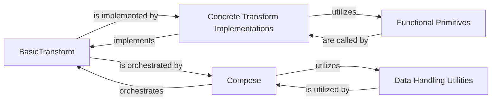

## Component Details

The `albumentations` library is designed around a modular and extensible architecture for efficient image augmentation. The core functionality revolves around defining individual transformations, composing them into pipelines, and ensuring consistent handling of various data types associated with images.

### BasicTransform
This is the foundational abstract base class for all individual image augmentation operations. It defines the common interface and contract that every transform must adhere to, including methods for applying the transformation (`apply`), generating random parameters (`get_params`), and handling serialization. It serves as the blueprint for extensibility, allowing new augmentations to be easily integrated.

**Related Classes/Methods**:

- <a href="https://github.com/albumentations-team/albumentations/blob/master/albumentations/core/transforms_interface.py#L0-L0" target="_blank" rel="noopener noreferrer">`albumentations.core.transforms_interface` (0:0)</a>

### Compose
The central orchestrator of the augmentation pipeline. `Compose` is responsible for chaining multiple `BasicTransform` instances together and applying them sequentially to input data. It manages the overall flow, including data preprocessing, the ordered application of transforms, postprocessing, and ensuring consistent random state management across the pipeline.

**Related Classes/Methods**:

- <a href="https://github.com/albumentations-team/albumentations/blob/master/albumentations/core/composition.py#L0-L0" target="_blank" rel="noopener noreferrer">`albumentations.core.composition` (0:0)</a>

### Data Handling Utilities
This consolidated component encompasses modules and classes (such as `albumentations.core.utils.DataProcessor`, `albumentations.core.bbox_utils`, `albumentations.core.keypoints_utils`, and `albumentations.core.label_manager`) dedicated to managing and transforming non-image data types. It ensures that bounding boxes, keypoints, and labels are correctly processed, validated, and transformed in sync with the image, which is crucial for tasks like object detection and segmentation.

**Related Classes/Methods**:

- <a href="https://github.com/albumentations-team/albumentations/blob/master/albumentations/core/utils.py#L0-L0" target="_blank" rel="noopener noreferrer">`albumentations.core.utils` (0:0)</a>
- <a href="https://github.com/albumentations-team/albumentations/blob/master/albumentations/core/bbox_utils.py#L0-L0" target="_blank" rel="noopener noreferrer">`albumentations.core.bbox_utils` (0:0)</a>
- <a href="https://github.com/albumentations-team/albumentations/blob/master/albumentations/core/keypoints_utils.py#L0-L0" target="_blank" rel="noopener noreferrer">`albumentations.core.keypoints_utils` (0:0)</a>
- <a href="https://github.com/albumentations-team/albumentations/blob/master/albumentations/core/label_manager.py#L0-L0" target="_blank" rel="noopener noreferrer">`albumentations.core.label_manager` (0:0)</a>

### Functional Primitives
These are modules containing low-level, stateless functions (e.g., `albumentations.augmentations.geometric.functional`, `albumentations.augmentations.pixel.functional`) that perform the actual mathematical and pixel-level image manipulations. They serve as the fundamental computational building blocks, providing the core algorithms that higher-level `Concrete Transform Implementations` utilize.

**Related Classes/Methods**:

- <a href="https://github.com/albumentations-team/albumentations/blob/master/albumentations/augmentations/geometric/functional.py#L0-L0" target="_blank" rel="noopener noreferrer">`albumentations.augmentations.geometric.functional` (0:0)</a>
- <a href="https://github.com/albumentations-team/albumentations/blob/master/albumentations/augmentations/pixel/functional.py#L0-L0" target="_blank" rel="noopener noreferrer">`albumentations.augmentations.pixel.functional` (0:0)</a>

### Concrete Transform Implementations
This represents the extensive set of specific classes that inherit from `BasicTransform` and implement a wide array of image augmentation algorithms (e.g., `RandomCrop`, `GaussianBlur`, `ShiftScaleRotate`, `Normalize`, `ToTensorV2`). These classes encapsulate the logic for applying particular transformations to images and their associated data, forming the bulk of the library's practical functionality.

**Related Classes/Methods**:

- <a href="https://github.com/albumentations-team/albumentations/blob/master/albumentations/augmentations/geometric/transforms.py#L0-L0" target="_blank" rel="noopener noreferrer">`albumentations.augmentations.geometric.transforms` (0:0)</a>
- <a href="https://github.com/albumentations-team/albumentations/blob/master/albumentations/augmentations/pixel/transforms.py#L0-L0" target="_blank" rel="noopener noreferrer">`albumentations.augmentations.pixel.transforms` (0:0)</a>
- <a href="https://github.com/albumentations-team/albumentations/blob/master/albumentations/augmentations/crops/transforms.py#L0-L0" target="_blank" rel="noopener noreferrer">`albumentations.augmentations.crops.transforms` (0:0)</a>
- <a href="https://github.com/albumentations-team/albumentations/blob/master/albumentations/augmentations/blur/transforms.py#L0-L0" target="_blank" rel="noopener noreferrer">`albumentations.augmentations.blur.transforms` (0:0)</a>
- <a href="https://github.com/albumentations-team/albumentations/blob/master/albumentations/augmentations/dropout/transforms.py#L0-L0" target="_blank" rel="noopener noreferrer">`albumentations.augmentations.dropout.transforms` (0:0)</a>
- <a href="https://github.com/albumentations-team/albumentations/blob/master/albumentations/augmentations/mixing/transforms.py#L0-L0" target="_blank" rel="noopener noreferrer">`albumentations.augmentations.mixing.transforms` (0:0)</a>
- <a href="https://github.com/albumentations-team/albumentations/blob/master/albumentations/pytorch/transforms.py#L0-L0" target="_blank" rel="noopener noreferrer">`albumentations.pytorch.transforms` (0:0)</a>

### [FAQ](https://github.com/CodeBoarding/GeneratedOnBoardings/tree/main?tab=readme-ov-file#faq)