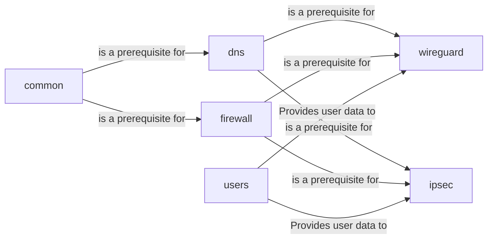

## Details

One paragraph explaining the functionality which is represented by this graph. What the main flow is and what is its purpose.

### common
A foundational role that executes prerequisite tasks for other roles, such as installing common packages, setting up unattended upgrades, and applying OS-level configurations.

**Related Classes/Methods**:

- `roles/common/tasks/main.yml`

### dns
Configures the system's DNS resolver, typically setting up a local caching resolver to enhance privacy and performance for VPN clients.

**Related Classes/Methods**:

- `roles/dns/tasks/main.yml`

### firewall
Manages network security by configuring `iptables`. It secures the server by default and creates specific rules to allow traffic for the selected VPN protocol.

**Related Classes/Methods**:

- `roles/firewall/tasks/main.yml`

### wireguard
Installs and configures the WireGuard VPN service. This includes managing kernel modules, generating cryptographic keys, and setting up network interfaces.

**Related Classes/Methods**:

- `roles/wireguard/tasks/main.yml`

### ipsec
Installs and configures the IPsec VPN service using strongSwan. It handles package installation, certificate setup, and connection profile configuration.

**Related Classes/Methods**:

- `roles/ipsec/tasks/main.yml`

### users
Manages the server-side VPN user accounts and credentials required by the IPsec and WireGuard services.

**Related Classes/Methods**:

- `roles/users/tasks/main.yml`

### [FAQ](https://github.com/CodeBoarding/GeneratedOnBoardings/tree/main?tab=readme-ov-file#faq)