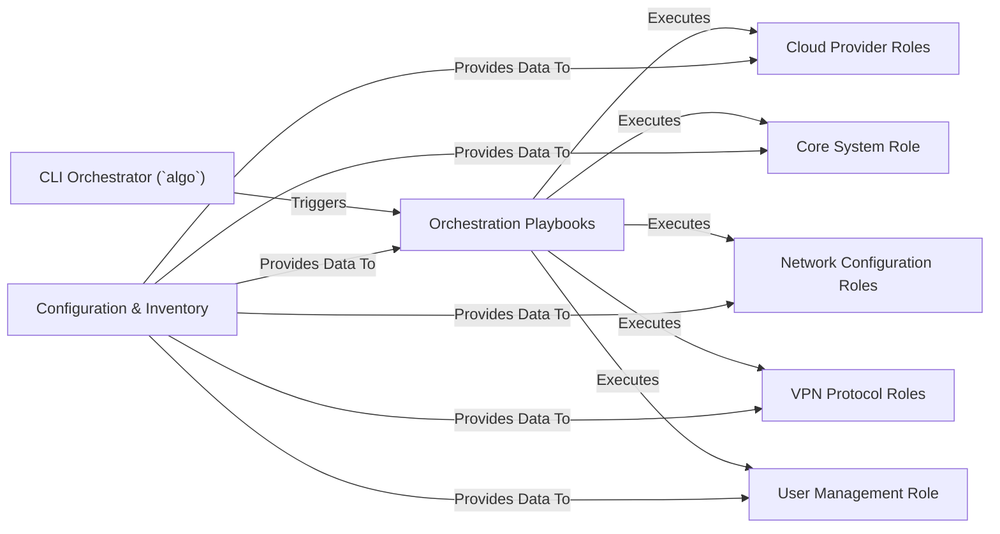

## Details

One paragraph explaining the functionality which is represented by this graph. What the main flow is and what is its purpose.

### CLI Orchestrator (`algo`)
The primary user interface and entry point for all operations. It translates user commands into executable Ansible playbook runs, passing along necessary parameters.

**Related Classes/Methods**:

- `algo`

### Orchestration Playbooks [[Expand]](./Orchestration_Playbooks.md)
Acts as the master controller, defining the sequence of operations. `cloud.yml` handles the end-to-end creation of a VPN server, while `deploy_client.yml` is used for managing user configurations on an existing server.

**Related Classes/Methods**:

- `cloud.yml`
- `deploy_client.yml`

### Configuration & Inventory
Stores all environment-specific data, including cloud provider API keys, desired server region, user lists, and feature flags. This separation of data from logic is a core architectural pattern.

**Related Classes/Methods**:

- `config.cfg`
- `inventory`

### Cloud Provider Roles
Abstracts the provider-specific logic for provisioning infrastructure. Each role in this group knows how to create, tag, and configure a virtual server for a specific cloud (e.g., `digitalocean`, `aws`).

**Related Classes/Methods**:

- `roles/digitalocean`
- `roles/aws`
- `roles/azure`
- `roles/gce`

### Core System Role
Establishes the baseline state of a newly provisioned server. This includes tasks like updating package caches, installing essential utilities (e.g., `unattended-upgrades`), and basic system hardening.

**Related Classes/Methods**:

- `roles/common`

### Network Configuration Roles
Manages the server's network access and name resolution. It configures the `ufw` firewall to allow only necessary traffic (e.g., SSH, VPN ports) and can set up DNS-related services.

**Related Classes/Methods**:

- `roles/firewall`
- `roles/dns`

### VPN Protocol Roles
Implements the detailed steps required to install and configure the chosen VPN protocols. This includes setting up strongSwan for IPsec and deploying the WireGuard kernel module and utilities.

**Related Classes/Methods**:

- `roles/ipsec`
- `roles/wireguard`

### User Management Role
Handles the lifecycle of VPN users. It adds new users, revokes access for existing users, and generates the necessary client configuration files (e.g., `.mobileconfig`, `.conf`).

**Related Classes/Methods**:

- `roles/users`

### [FAQ](https://github.com/CodeBoarding/GeneratedOnBoardings/tree/main?tab=readme-ov-file#faq)