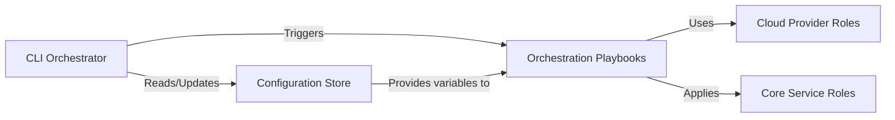

## Details

One paragraph explaining the functionality which is represented by this graph. What the main flow is and what is its purpose.

### CLI Orchestrator
Provides a simplified command-line interface for users to manage the VPN lifecycle. It wraps underlying Ansible commands to handle server deployment, updates, and user management.

**Related Classes/Methods**:

- `algo`

### Configuration Store
Manages all user-defined variables, including cloud provider credentials, server options, and lists of VPN users. This component decouples configuration from execution logic.

**Related Classes/Methods**:

- `config.cfg`
- `configs/`

### Orchestration Playbooks [[Expand]](./Orchestration_Playbooks.md)
Acts as the central controller, defining the high-level sequence of tasks for provisioning servers and deploying client configurations. It coordinates the execution of various roles.

**Related Classes/Methods**:

- `cloud.yml`
- `deploy_client.yml`

### Cloud Provider Roles
A collection of modular roles, each responsible for the specific API interactions required to provision a virtual machine on a supported cloud provider (e.g., AWS, Azure, DigitalOcean).

**Related Classes/Methods**:

- `roles/cloud_digitalocean`
- `roles/cloud_aws`
- `roles/cloud_azure`

### Core Service Roles [[Expand]](./Core_Service_Roles.md)
A set of roles responsible for configuring the server's primary functions. This includes installing and setting up the chosen VPN protocol (WireGuard/IPsec), the firewall, DNS, and user accounts.

**Related Classes/Methods**:

- `roles/wireguard`
- `roles/ipsec`
- `roles/firewall`
- `roles/dns`
- `roles/users`

### [FAQ](https://github.com/CodeBoarding/GeneratedOnBoardings/tree/main?tab=readme-ov-file#faq)