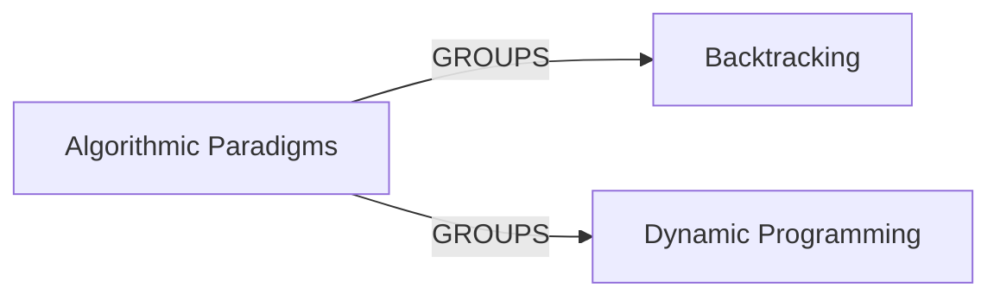

## Details

This analysis outlines the architecture of the `Algorithmic Paradigms` subsystem for the `Educational Library` project. Based on the provided context, this subsystem is a conceptual grouping of high-level problem-solving strategies.

### Algorithmic Paradigms [[Expand]](./Algorithmic_Paradigms.md)
A high-level, conceptual component that encapsulates distinct, strategy-based collections of algorithms. It serves as the primary entry point for understanding and using backtracking and dynamic programming solutions.

**Related Classes/Methods**:

- `algorithms/backtrack/`
- `algorithms/dp/`

### Backtracking
Implements a collection of functions that solve combinatorial and constraint-satisfaction problems using the backtracking strategy. Each function is a self-contained example of the paradigm.

**Related Classes/Methods**:

- `algorithms/backtrack/`

### Dynamic Programming
Implements a collection of functions that solve optimization and counting problems using dynamic programming. It includes classic problems solved with both memoization and tabulation techniques.

**Related Classes/Methods**:

- `algorithms/dp/`

### [FAQ](https://github.com/CodeBoarding/GeneratedOnBoardings/tree/main?tab=readme-ov-file#faq)