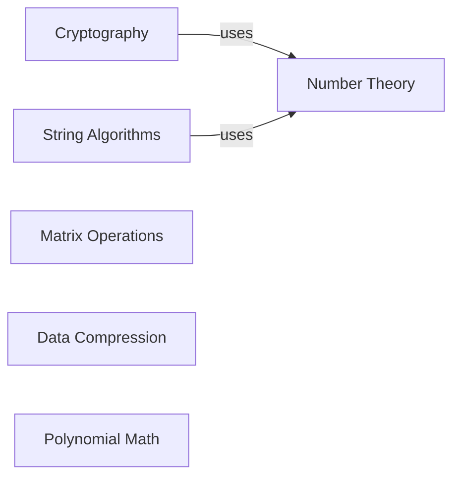

## Details

One paragraph explaining the functionality which is represented by this graph. What the main flow is and what is its purpose.

### Number Theory
Provides fundamental algorithms for number theory, primarily focused on integers. These are foundational utilities used by more complex components.

**Related Classes/Methods**:

- `algorithms.math.gcd`
- `algorithms.math.prime_check`
- `algorithms.math.extended_gcd`

### Cryptography
Implements cryptographic algorithms. This component demonstrates the application of number theory to secure communications.

**Related Classes/Methods**:

- `algorithms.crypto.rsa`

### String Algorithms
Implements a collection of algorithms for string pattern matching, searching, and manipulation.

**Related Classes/Methods**:

- `algorithms.string.rabin_karp`
- `algorithms.string.min_distance`
- `algorithms.string.lcs`

### Matrix Operations
Offers a suite of algorithms for common matrix operations, including inversion, determinant calculation, and exponentiation.

**Related Classes/Methods**:

- `algorithms.matrix.matrix_inversion`
- `algorithms.matrix.get_determinant`
- `algorithms.matrix.matrix_exponentiation`

### Data Compression
Contains algorithms for lossless data compression, demonstrating techniques to reduce data size.

**Related Classes/Methods**:

- `algorithms.compression.huffman_coding`
- `algorithms.compression.elias_gamma`

### Polynomial Math
Provides functions for algebraic operations on polynomials.

**Related Classes/Methods**:

- `algorithms.math.polynomial`

### [FAQ](https://github.com/CodeBoarding/GeneratedOnBoardings/tree/main?tab=readme-ov-file#faq)