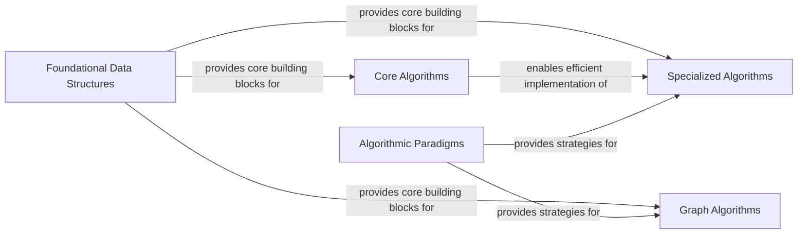

## Details

One paragraph explaining the functionality which is represented by this graph. What the main flow is and what is its purpose.

### Foundational Data Structures
Forms the bedrock of the entire library, providing the fundamental building blocks for all other algorithmic components. It includes linear structures (queues, stacks, linked lists), hierarchical structures (trees, heaps), and key-value mappings (hash tables).

**Related Classes/Methods**:

- `algorithms/arrays`
- `algorithms/linked_lists`
- `algorithms/queue`
- `algorithms/stack`
- `algorithms/heap`
- `algorithms/tree`
- `algorithms/hashtable`

### Core Algorithms
Implements essential, general-purpose algorithms that are central to computer science. This component focuses on sorting data collections (e.g., Quick Sort, Merge Sort) and efficiently searching within them (e.g., Binary Search).

**Related Classes/Methods**:

- `algorithms/sorting`
- `algorithms/searching`

### Graph Algorithms
A dedicated component for algorithms that operate on graph structures. It covers traversal (BFS, DFS), shortest path finding (Dijkstra's), and cycle detection, solving complex network and connectivity problems.

**Related Classes/Methods**:

- `algorithms/graph`
- `algorithms/bfs`
- `algorithms/dfs`

### Algorithmic Paradigms [[Expand]](./Algorithmic_Paradigms.md)
Implements high-level, abstract strategies for solving complex computational problems. This includes Dynamic Programming for optimization and Backtracking for combinatorial searches, which are applied across various domains.

**Related Classes/Methods**:

- `algorithms/backtrack`
- `algorithms/dynamic_programming`

### Specialized Algorithms [[Expand]](./Specialized_Algorithms.md)
A collection of algorithms for specific problem domains, including number theory and cryptography, string pattern matching and manipulation, matrix operations, and data compression.

**Related Classes/Methods**:

- `algorithms/math`
- `algorithms/string`
- `algorithms/compression`
- `algorithms/crypto`
- `algorithms/matrix`

### [FAQ](https://github.com/CodeBoarding/GeneratedOnBoardings/tree/main?tab=readme-ov-file#faq)