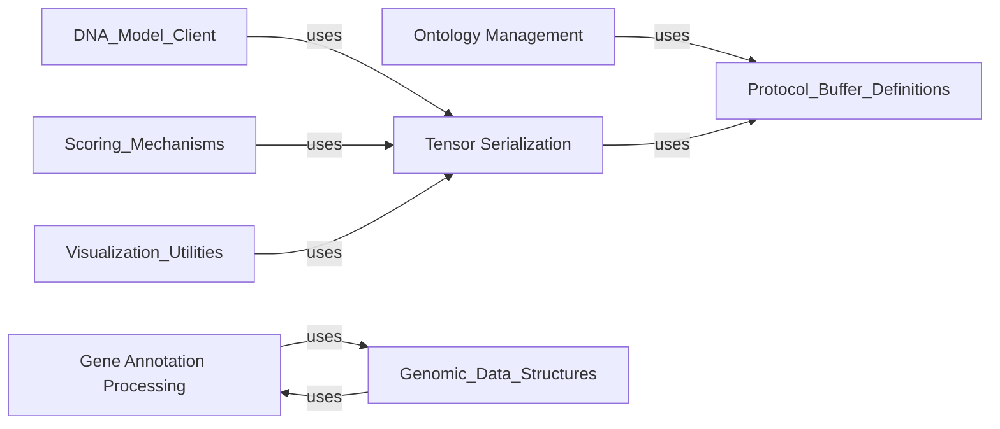

## Details

The `Core Utilities` component is a foundational layer within the `alphagenome` SDK, providing essential functionalities that underpin various other components. It is designed to handle common data manipulation tasks, standardize biological annotations, and facilitate efficient data exchange, particularly for numerical tensors. This component is fundamental because it addresses cross-cutting concerns, ensuring data consistency, interoperability, and performance across the entire library. Without these core utilities, other components would need to re-implement basic data handling, leading to redundancy and potential inconsistencies.

### Ontology Management
This sub-component is responsible for the standardized representation and handling of biological ontology terms. It defines OntologyType (e.g., Cell Line Ontology, Uber-anatomy ontology) and OntologyTerm objects, providing utilities to convert these terms to and from CURIE (Compact Uniform Resource Identifier) strings and Protocol Buffer messages. This ensures consistent annotation and interpretation of biological data throughout the SDK.

**Related Classes/Methods**:

- <a href="https://github.com/google-deepmind/alphagenome/blob/main/src/alphagenome/data/ontology.py" target="_blank" rel="noopener noreferrer">`alphagenome.data.ontology`</a>

### Gene Annotation Processing
This sub-component provides utilities for parsing, filtering, and extracting specific information from external gene annotation data, such as GTF (Gene Transfer Format) files. It includes functionalities to extract transcription start sites (TSS), filter transcripts by type (e.g., protein-coding), and identify the longest transcript for each gene. This facilitates the integration and manipulation of external genomic annotation data within the SDK.

**Related Classes/Methods**:

- <a href="https://github.com/google-deepmind/alphagenome/blob/main/src/alphagenome/data/gene_annotation.py" target="_blank" rel="noopener noreferrer">`alphagenome.data.gene_annotation`</a>

### Tensor Serialization
This sub-component focuses on the efficient packing, unpacking, and compression/decompression of numerical tensor data. It provides functions to convert NumPy arrays into Protocol Buffer messages (Tensor and TensorChunk) and vice-versa, supporting various data types and compression methods (e.g., Zstandard). This is critical for efficient data exchange, especially for large numerical datasets common in machine learning models and genomic analyses.

**Related Classes/Methods**:

- <a href="https://github.com/google-deepmind/alphagenome/blob/main/src/alphagenome/tensor_utils.py" target="_blank" rel="noopener noreferrer">`alphagenome.tensor_utils`</a>

### [FAQ](https://github.com/CodeBoarding/GeneratedOnBoardings/tree/main?tab=readme-ov-file#faq)