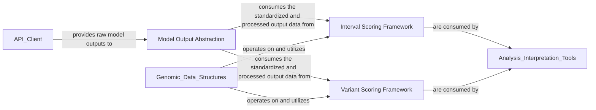

## Details

The `Genomic Analysis & Scoring` component is a critical part of the `alphagenome` project, focusing on transforming raw genomic model outputs into actionable biological insights through specialized scoring mechanisms. It adheres to the project's architectural bias by providing a clear separation of concerns for data handling and analytical tools.

### Model Output Abstraction
This component is responsible for defining and managing the structured representation of raw genomic model outputs, particularly those received from the `API Client`. It acts as a crucial bridge, transforming raw API responses (likely in protobuf format) into standardized, user-friendly genomic data structures. This ensures data consistency and accessibility for downstream analysis and scoring. The `Output` class serves as a base for structured model results, and `OutputType` defines the expected output structure for various consumers, including the scoring components.

**Related Classes/Methods**:

- <a href="https://github.com/google-deepmind/alphagenome/blob/main/src/alphagenome/models/dna_output.py#L76-L291" target="_blank" rel="noopener noreferrer">`alphagenome.models.dna_output.Output` (76:291)</a>
- <a href="https://github.com/google-deepmind/alphagenome/blob/main/src/alphagenome/models/dna_output.py#L397-L406" target="_blank" rel="noopener noreferrer">`alphagenome.models.dna_output.VariantOutput` (397:406)</a>
- <a href="https://github.com/google-deepmind/alphagenome/blob/main/src/alphagenome/models/dna_output.py#L28-L71" target="_blank" rel="noopener noreferrer">`alphagenome.models.dna_output.OutputType` (28:71)</a>

### Interval Scoring Framework
This component provides the foundational classes and concrete implementations for applying various scoring algorithms to genomic intervals. It processes the standardized data from the `Model Output Abstraction` to generate quantitative scores relevant to specific genomic regions, such as gene masks or regulatory elements. This framework is essential for deriving insights from interval-based predictions.

**Related Classes/Methods**:

- <a href="https://github.com/google-deepmind/alphagenome/blob/main/src/alphagenome/models/interval_scorers.py#L76-L128" target="_blank" rel="noopener noreferrer">`alphagenome.models.interval_scorers.GeneMaskScorer` (76:128)</a>
- <a href="https://github.com/google-deepmind/alphagenome/blob/main/src/alphagenome/models/interval_scorers.py#L26-L44" target="_blank" rel="noopener noreferrer">`alphagenome.models.interval_scorers.IntervalAggregationType` (26:44)</a>

### Variant Scoring Framework
This component offers a comprehensive set of tools and algorithms specifically designed for scoring individual genomic variants. It takes processed model outputs and applies specialized scoring logic to assess the impact, pathogenicity, or functional significance of genetic variations. This framework is crucial for detailed variant analysis and interpretation.

**Related Classes/Methods**:

- <a href="https://github.com/google-deepmind/alphagenome/blob/main/src/alphagenome/models/variant_scorers.py#L154-L234" target="_blank" rel="noopener noreferrer">`alphagenome.models.variant_scorers.CenterMaskScorer` (154:234)</a>
- <a href="https://github.com/google-deepmind/alphagenome/blob/main/src/alphagenome/models/variant_scorers.py#L336-L388" target="_blank" rel="noopener noreferrer">`alphagenome.models.variant_scorers.GeneMaskActiveScorer` (336:388)</a>
- <a href="https://github.com/google-deepmind/alphagenome/blob/main/src/alphagenome/models/variant_scorers.py#L281-L332" target="_blank" rel="noopener noreferrer">`alphagenome.models.variant_scorers.GeneMaskLFCScorer` (281:332)</a>
- <a href="https://github.com/google-deepmind/alphagenome/blob/main/src/alphagenome/models/variant_scorers.py#L392-L452" target="_blank" rel="noopener noreferrer">`alphagenome.models.variant_scorers.GeneMaskSplicingScorer` (392:452)</a>
- <a href="https://github.com/google-deepmind/alphagenome/blob/main/src/alphagenome/models/variant_scorers.py#L456-L498" target="_blank" rel="noopener noreferrer">`alphagenome.models.variant_scorers.PolyadenylationScorer` (456:498)</a>
- <a href="https://github.com/google-deepmind/alphagenome/blob/main/src/alphagenome/models/variant_scorers.py#L502-L536" target="_blank" rel="noopener noreferrer">`alphagenome.models.variant_scorers.SpliceJunctionScorer` (502:536)</a>
- <a href="https://github.com/google-deepmind/alphagenome/blob/main/src/alphagenome/models/variant_scorers.py#L30-L62" target="_blank" rel="noopener noreferrer">`alphagenome.models.variant_scorers.AggregationType` (30:62)</a>

### [FAQ](https://github.com/CodeBoarding/GeneratedOnBoardings/tree/main?tab=readme-ov-file#faq)