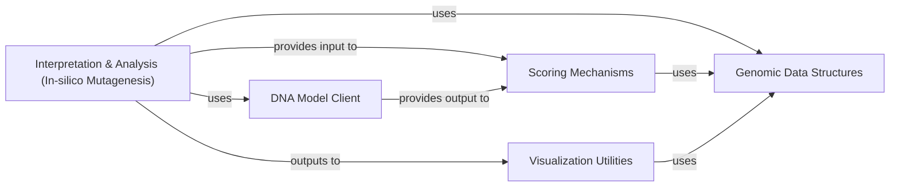

## Details

This analysis focuses on the 'Interpretation & Analysis (In-silico Mutagenesis)' component within the 'alphagenome' project, detailing its interactions and dependencies with other core components to form a cohesive pipeline for performing and interpreting in-silico mutagenesis.

### Interpretation & Analysis (In-silico Mutagenesis)
This component provides the core logic and tools for performing in-silico mutagenesis (ISM) analysis. It systematically mutates input genomic sequences to assess the impact of individual nucleotides or regions on model predictions, thereby generating interpretable insights into model behavior and feature importance. This is fundamental for a Bioinformatics/Genomics SDK as it moves beyond mere prediction to provide actionable biological insights.

**Related Classes/Methods**:

- `alphagenome.interpretation` (1:1)

### Genomic Data Structures
This component is responsible for representing and manipulating genomic sequences, intervals, and other biological data. It provides the foundational data types that the ISM component operates on, allowing for efficient storage, retrieval, and modification of DNA sequences for mutation.

**Related Classes/Methods**:

- <a href="https://github.com/google-deepmind/alphagenome/blob/main/src/alphagenome/data/genome.py#L1-L1" target="_blank" rel="noopener noreferrer">`alphagenome.data.genome` (1:1)</a>
- `alphagenome.data` (1:1)

### DNA Model Client
This component provides the interface for interacting with trained DNA models to obtain predictions. The ISM component relies heavily on this client to query the model with mutated sequences and receive prediction scores, which are then used to calculate importance.

**Related Classes/Methods**:

- <a href="https://github.com/google-deepmind/alphagenome/blob/main/src/alphagenome/models/dna_output.py#L1-L1" target="_blank" rel="noopener noreferrer">`alphagenome.models.dna_output` (1:1)</a>

### Scoring Mechanisms
This component encapsulates various methods for quantifying the impact of mutations or aggregating importance scores derived from ISM analysis. It takes the raw predictions from the DNA Model Client and processes them into meaningful scores that highlight feature importance.

**Related Classes/Methods**:

- <a href="https://github.com/google-deepmind/alphagenome/blob/main/src/alphagenome/models/interval_scorers.py#L1-L1" target="_blank" rel="noopener noreferrer">`alphagenome.models.interval_scorers` (1:1)</a>
- <a href="https://github.com/google-deepmind/alphagenome/blob/main/src/alphagenome/models/variant_scorers.py#L1-L1" target="_blank" rel="noopener noreferrer">`alphagenome.models.variant_scorers` (1:1)</a>

### Visualization Utilities
This component is responsible for generating plots and visual representations of analysis results, such as saliency maps, sequence logos, or other visualizations that help interpret ISM outputs. It translates numerical importance scores into intuitive graphical formats.

**Related Classes/Methods**:

- <a href="https://github.com/google-deepmind/alphagenome/blob/main/src/alphagenome/visualization/plot_components.py#L1-L1" target="_blank" rel="noopener noreferrer">`alphagenome.visualization.plot_components` (1:1)</a>
- `alphagenome.visualization` (1:1)

### [FAQ](https://github.com/CodeBoarding/GeneratedOnBoardings/tree/main?tab=readme-ov-file#faq)