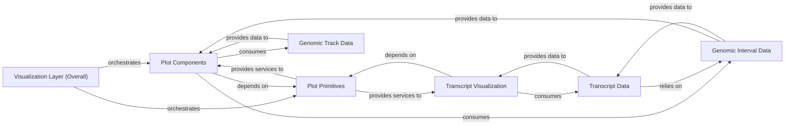

## Details

These components are fundamental because they represent distinct layers of abstraction and responsibility within the `Visualization Layer`, aligning with the project's architectural bias towards modular design and clear separation of concerns:

*   **`Visualization Layer (Overall)`**: This is the top-level entry point for users, encapsulating all visualization capabilities. It's fundamental as it defines the scope and purpose of the entire subsystem.
*   **`Plot Components`**: These are the high-level, user-facing building blocks. They are fundamental because they provide the pre-packaged, complex visualizations that users will directly interact with, abstracting away the underlying plotting details. Their inheritance from `AbstractComponent` highlights their role as a structured framework.
*   **`Plot Primitives`**: These are the lowest-level graphical operations. They are fundamental because without these basic drawing capabilities, no higher-level visualization can be constructed. They form the bedrock of the entire visualization system.
*   **`Transcript Visualization`**: Given the domain of genomics, transcript analysis is a specialized and crucial area. This component is fundamental because it addresses a specific, complex visualization need that warrants its own dedicated module, ensuring clarity and maintainability for transcript-related plots.
*   **`Genomic Interval Data`, `Genomic Track Data`, `Transcript Data`**: These are the data models that the visualization components operate on. They are absolutely fundamental because visualizations are meaningless without the data they represent. Their distinct roles (intervals, tracks, transcripts) reflect the different types of genomic information that need to be visualized, ensuring that the visualization layer can handle the diverse data structures inherent in genomics.

### Visualization Layer (Overall)
The overarching component providing a comprehensive suite of tools for visualizing genomic data and model outputs. It integrates various plotting functionalities, from low-level primitives to high-level interactive plots, making the SDK highly usable for genomic research.

**Related Classes/Methods**:

- <a href="https://github.com/google-deepmind/alphagenome/blob/main/src/alphagenome/visualization/__init__.py" target="_blank" rel="noopener noreferrer">`alphagenome/visualization/__init__.py`</a>

### Plot Components
This is the core of the visualization layer, providing high-level, reusable components for common genomic plot types such as `ContactMaps`, `Sashimi`, `SeqLogo`, `Tracks`, and `TranscriptAnnotation`. These components abstract complex plotting logic and are built upon abstract base classes like `AbstractComponent` and `AbstractAnnotation`.

**Related Classes/Methods**:

- <a href="https://github.com/google-deepmind/alphagenome/blob/main/src/alphagenome/visualization/plot_components.py" target="_blank" rel="noopener noreferrer">`alphagenome/visualization/plot_components.py`</a>

### Plot Primitives
Contains foundational, low-level plotting functions and utilities. These serve as the basic building blocks for more complex visualizations, providing the core drawing routines that higher-level components utilize.

**Related Classes/Methods**:

- <a href="https://github.com/google-deepmind/alphagenome/blob/main/src/alphagenome/visualization/plot.py" target="_blank" rel="noopener noreferrer">`alphagenome/visualization/plot.py`</a>

### Transcript Visualization
Specializes in generating visualizations specific to transcript information, crucial for detailed analysis of gene expression and splicing. This includes detailed transcript annotations and splicing patterns.

**Related Classes/Methods**:

- <a href="https://github.com/google-deepmind/alphagenome/blob/main/src/alphagenome/visualization/plot_transcripts.py" target="_blank" rel="noopener noreferrer">`alphagenome/visualization/plot_transcripts.py`</a>

### Genomic Interval Data
Manages fundamental genomic interval data, including basic intervals and junction information. This data is crucial for defining regions of interest and structural elements in various visualizations.

**Related Classes/Methods**:

- <a href="https://github.com/google-deepmind/alphagenome/blob/main/src/alphagenome/data/genome.py" target="_blank" rel="noopener noreferrer">`alphagenome/data/genome.py`</a>

### Genomic Track Data
Handles data organized as tracks, typically representing genomic signals or features (e.g., coverage, scores) across a genomic region. This is essential for track plots and contact maps.

**Related Classes/Methods**:

- <a href="https://github.com/google-deepmind/alphagenome/blob/main/src/alphagenome/data/track_data.py" target="_blank" rel="noopener noreferrer">`alphagenome/data/track_data.py`</a>

### Transcript Data
Encapsulates the structure and logic for handling transcript-specific information, including exons, introns, and splicing events. This component is vital for transcript-centric visualizations.

**Related Classes/Methods**:

- <a href="https://github.com/google-deepmind/alphagenome/blob/main/src/alphagenome/data/transcript.py" target="_blank" rel="noopener noreferrer">`alphagenome/data/transcript.py`</a>

### [FAQ](https://github.com/CodeBoarding/GeneratedOnBoardings/tree/main?tab=readme-ov-file#faq)