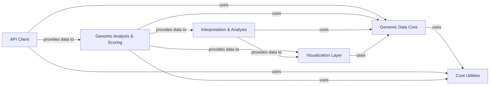

## Details

The `alphagenome` project is structured as a Bioinformatics/Genomics SDK/Client Library, designed to facilitate interaction with a backend for genomic analysis and visualization. The architecture emphasizes modularity, clear separation of concerns, and efficient data handling.

### Genomic Data Core
This foundational component defines and manages all core and specialized data models for genomic regions, variations, RNA-seq junction data, and generic genomic tracks. It provides the basic building blocks and methods for manipulating, filtering, transforming, and serializing genomic data within the SDK.

**Related Classes/Methods**:

- <a href="https://github.com/google-deepmind/alphagenome/blob/main/src/alphagenome/data/genome.py" target="_blank" rel="noopener noreferrer">`alphagenome.data.genome.*`</a>
- <a href="https://github.com/google-deepmind/alphagenome/blob/main/src/alphagenome/data/junction_data.py" target="_blank" rel="noopener noreferrer">`alphagenome.data.junction_data.*`</a>
- <a href="https://github.com/google-deepmind/alphagenome/blob/main/src/alphagenome/data/track_data.py" target="_blank" rel="noopener noreferrer">`alphagenome.data.track_data.*`</a>
- <a href="https://github.com/google-deepmind/alphagenome/blob/main/src/alphagenome/data/transcript.py" target="_blank" rel="noopener noreferrer">`alphagenome.data.transcript.*`</a>

### Core Utilities [[Expand]](./Core_Utilities.md)
This component provides foundational utilities essential across the SDK. It handles efficient data serialization (packing, unpacking, compression of tensors), manages biological ontology terms for standardized annotations, and processes external gene annotation data (e.g., GTF files) for integration into genomic models.

**Related Classes/Methods**:

- <a href="https://github.com/google-deepmind/alphagenome/blob/main/src/alphagenome/data/ontology.py" target="_blank" rel="noopener noreferrer">`alphagenome.data.ontology.*`</a>
- <a href="https://github.com/google-deepmind/alphagenome/blob/main/src/alphagenome/tensor_utils.py" target="_blank" rel="noopener noreferrer">`alphagenome.tensor_utils.*`</a>
- <a href="https://github.com/google-deepmind/alphagenome/blob/main/src/alphagenome/data/gene_annotation.py" target="_blank" rel="noopener noreferrer">`alphagenome.data.gene_annotation.*`</a>

### API Client
This is the primary interface for users to interact with the `alphagenome` backend models. It encapsulates the gRPC communication logic, sending requests for sequence prediction, interval scoring, and variant scoring to the server, and receiving raw responses.

**Related Classes/Methods**:

- <a href="https://github.com/google-deepmind/alphagenome/blob/main/src/alphagenome/models/dna_client.py" target="_blank" rel="noopener noreferrer">`alphagenome.models.dna_client.*`</a>

### Genomic Analysis & Scoring [[Expand]](./Genomic_Analysis_Scoring.md)
This component defines and manages various types of scorers applied to genomic intervals and variants to generate predictions or scores. It also structures and provides user-friendly methods for manipulating the output data received from the `API Client`, transforming raw API responses into actionable insights and standardized data formats.

**Related Classes/Methods**:

- <a href="https://github.com/google-deepmind/alphagenome/blob/main/src/alphagenome/models/interval_scorers.py" target="_blank" rel="noopener noreferrer">`alphagenome.models.interval_scorers.*`</a>
- <a href="https://github.com/google-deepmind/alphagenome/blob/main/src/alphagenome/models/variant_scorers.py" target="_blank" rel="noopener noreferrer">`alphagenome.models.variant_scorers.*`</a>
- <a href="https://github.com/google-deepmind/alphagenome/blob/main/src/alphagenome/models/dna_output.py" target="_blank" rel="noopener noreferrer">`alphagenome.models.dna_output.*`</a>

### Interpretation & Analysis [[Expand]](./Interpretation_Analysis.md)
This component offers specialized tools for interpreting model predictions, with a particular focus on in-silico mutagenesis (ISM) analysis. It enables systematic mutation of sequences to understand feature importance and generate interpretable insights into model behavior.

**Related Classes/Methods**:

- <a href="https://github.com/google-deepmind/alphagenome/blob/main/src/alphagenome/interpretation/ism.py" target="_blank" rel="noopener noreferrer">`alphagenome.interpretation.ism.*`</a>

### Visualization Layer [[Expand]](./Visualization_Layer.md)
This comprehensive component provides a rich set of tools for visualizing genomic data and model outputs. It includes low-level plotting primitives (e.g., sequence logos, track plots) and high-level components for constructing complex, interactive genomic plots such as sashimi plots, contact maps, and detailed transcript annotations.

**Related Classes/Methods**:

- <a href="https://github.com/google-deepmind/alphagenome/blob/main/src/alphagenome/visualization/plot.py" target="_blank" rel="noopener noreferrer">`alphagenome.visualization.plot.*`</a>
- <a href="https://github.com/google-deepmind/alphagenome/blob/main/src/alphagenome/visualization/plot_components.py" target="_blank" rel="noopener noreferrer">`alphagenome.visualization.plot_components.*`</a>
- <a href="https://github.com/google-deepmind/alphagenome/blob/main/src/alphagenome/visualization/plot_transcripts.py" target="_blank" rel="noopener noreferrer">`alphagenome.visualization.plot_transcripts.*`</a>

### [FAQ](https://github.com/CodeBoarding/GeneratedOnBoardings/tree/main?tab=readme-ov-file#faq)