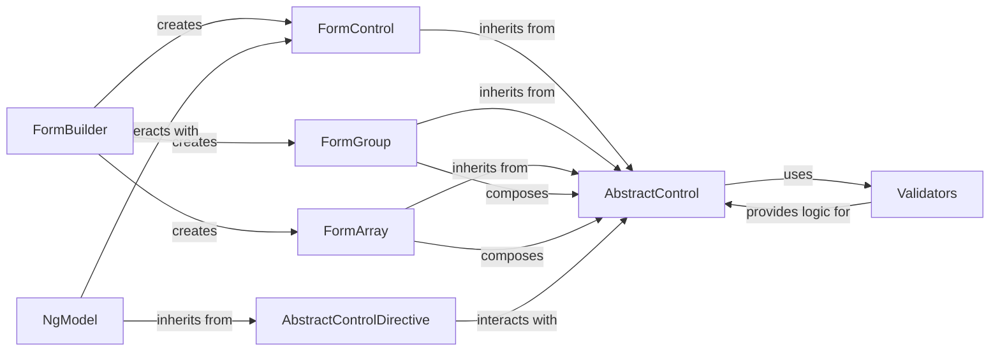

## Details

The Angular Forms subsystem is built around a core set of abstract and concrete components that facilitate the creation, management, and validation of user input. At its heart is the `AbstractControl`, serving as the base class for all form elements, defining their common state and behavior. `FormControl` represents individual input fields, while `FormGroup` and `FormArray` act as composite controls, managing collections of other `AbstractControl` instances. The `FormBuilder` simplifies the programmatic instantiation of these controls, acting as a factory. Directives like `AbstractControlDirective` and `NgModel` bridge the gap between the form model and the HTML view, enabling two-way data binding. Finally, the `Validators` component provides a suite of pre-built validation functions that can be applied to any `AbstractControl`, ensuring data integrity. This architecture promotes a clear separation of concerns, with distinct components handling model representation, view interaction, and validation logic, making the forms highly modular and testable.

Critical Interaction Pathways:
1.  **Form Control Creation and Composition**:
    *   `FormBuilder` **creates** `FormControl`, `FormGroup`, and `FormArray` instances.
    *   `FormGroup` **composes** `AbstractControl` instances (which can be `FormControl`, `FormGroup`, or `FormArray`).
    *   `FormArray` **composes** `AbstractControl` instances.

2.  **Data Binding and View Interaction**:
    *   `NgModel` **interacts with** `FormControl` to provide two-way data binding in template-driven forms.
    *   `AbstractControlDirective` **interacts with** `AbstractControl` to provide common properties and methods for directives.

3.  **Validation Flow**:
    *   `AbstractControl` **uses** `Validators` to apply validation rules.
    *   `Validators` **provides logic for** `AbstractControl` instances, returning validation errors.

### AbstractControl [[Expand]](./AbstractControl.md)
The foundational abstract class for all form controls. It defines the common API and state management (e.g., `value`, `status`, `valid`, `dirty`, `touched`, `pristine`). It serves as the base for individual controls and groups of controls, embodying the core "Model" aspect of the MVVM pattern within Angular Forms.

**Related Classes/Methods**:

- <a href="https://github.com/angular/angular/blob/main/packages/forms/src/model/form_control.ts#L193-L359" target="_blank" rel="noopener noreferrer">`FormControl`:193-359</a>
- <a href="https://github.com/angular/angular/blob/main/packages/forms/src/directives/form_interface.ts" target="_blank" rel="noopener noreferrer">`FormGroup`</a>
- <a href="https://github.com/angular/angular/blob/main/packages/forms/src/model/form_array.ts#L117-L547" target="_blank" rel="noopener noreferrer">`FormArray`:117-547</a>
- <a href="https://github.com/angular/angular/blob/main/.ng-dev/pull-request.mts#L21-L24" target="_blank" rel="noopener noreferrer">`Validators`:21-24</a>

### FormControl [[Expand]](./FormControl.md)
Represents an individual input field. It extends `AbstractControl` to manage a single form element's value and validation status. This is a concrete implementation of a basic form Model.

**Related Classes/Methods**:

- <a href="https://github.com/angular/angular/blob/main/packages/forms/src/model/abstract_model.ts#L468-L1767" target="_blank" rel="noopener noreferrer">`AbstractControl`:468-1767</a>
- <a href="https://github.com/angular/angular/blob/main/packages/forms/src/form_builder.ts#L139-L407" target="_blank" rel="noopener noreferrer">`FormBuilder`:139-407</a>

### FormGroup [[Expand]](./FormGroup.md)
Manages a collection of `AbstractControl` instances (which can be `FormControl`, `FormGroup`, or `FormArray`) as a single unit. It derives its overall value and status from its children, embodying the concept of a composite Model for structured forms.

**Related Classes/Methods**:

- <a href="https://github.com/angular/angular/blob/main/packages/forms/src/model/abstract_model.ts#L468-L1767" target="_blank" rel="noopener noreferrer">`AbstractControl`:468-1767</a>

### FormArray
Manages a dynamic, ordered collection of `AbstractControl` instances. Useful for lists of form elements, it's another composite Model, but for dynamic lists.

**Related Classes/Methods**:

- <a href="https://github.com/angular/angular/blob/main/packages/forms/src/model/abstract_model.ts#L468-L1767" target="_blank" rel="noopener noreferrer">`AbstractControl`:468-1767</a>

### FormBuilder [[Expand]](./FormBuilder.md)
A utility service that simplifies the programmatic creation of `FormControl`, `FormGroup`, and `FormArray` instances. It promotes cleaner and more concise code for constructing complex forms, adhering to the Service pattern.

**Related Classes/Methods**:

- <a href="https://github.com/angular/angular/blob/main/packages/forms/src/model/form_control.ts#L193-L359" target="_blank" rel="noopener noreferrer">`FormControl`:193-359</a>
- <a href="https://github.com/angular/angular/blob/main/packages/forms/src/directives/form_interface.ts" target="_blank" rel="noopener noreferrer">`FormGroup`</a>
- <a href="https://github.com/angular/angular/blob/main/packages/forms/src/model/form_array.ts#L117-L547" target="_blank" rel="noopener noreferrer">`FormArray`:117-547</a>

### AbstractControlDirective
An abstract base for directives that interact directly with an `AbstractControl`. It provides common properties and methods to access the control's state, serving as a key part of the View-Model binding mechanism.

**Related Classes/Methods**:

- <a href="https://github.com/angular/angular/blob/main/packages/forms/src/model/abstract_model.ts#L468-L1767" target="_blank" rel="noopener noreferrer">`AbstractControl`:468-1767</a>
- <a href="https://github.com/angular/angular/blob/main/packages/forms/src/directives/ng_model.ts#L161-L374" target="_blank" rel="noopener noreferrer">`NgModel`:161-374</a>

### NgModel [[Expand]](./NgModel.md)
Implements two-way data binding for template-driven forms. It implicitly creates and manages a `FormControl` behind the scenes, bridging the View (HTML input) and the Model (`FormControl`).

**Related Classes/Methods**:

- <a href="https://github.com/angular/angular/blob/main/packages/forms/src/directives/abstract_control_directive.ts#L30-L334" target="_blank" rel="noopener noreferrer">`AbstractControlDirective`:30-334</a>
- <a href="https://github.com/angular/angular/blob/main/packages/forms/src/model/form_control.ts#L193-L359" target="_blank" rel="noopener noreferrer">`FormControl`:193-359</a>

### Validators
Provides static methods for common validation patterns (e.g., `required`, `minLength`, `pattern`). These functions are used to define validation rules for `AbstractControl` instances, representing the crucial validation logic aspect of the forms subsystem.

**Related Classes/Methods**:

- <a href="https://github.com/angular/angular/blob/main/packages/forms/src/model/abstract_model.ts#L468-L1767" target="_blank" rel="noopener noreferrer">`AbstractControl`:468-1767</a>

### [FAQ](https://github.com/CodeBoarding/GeneratedOnBoardings/tree/main?tab=readme-ov-file#faq)