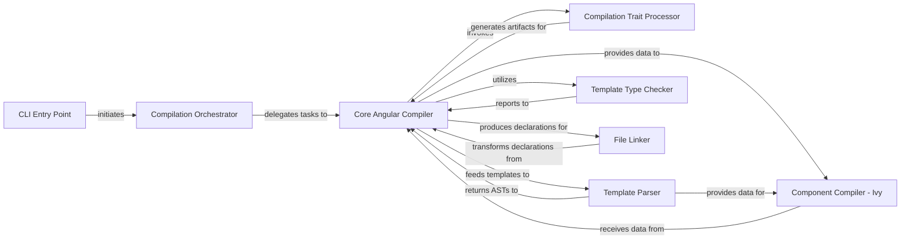

## Details

The Angular Type-Check Compiler (ngtsc) subsystem orchestrates the transformation of Angular source code into optimized JavaScript. The process begins with the **CLI Entry Point** (ngc), which parses user commands and initiates the **Compilation Orchestrator**. This orchestrator then configures and drives the **Core Angular Compiler**, the central component responsible for managing the entire compilation pipeline. The Core Compiler leverages the **Compilation Trait Processor** to analyze Angular-specific metadata and the **Template Parser** to convert HTML templates into an Abstract Syntax Tree (AST). These parsed templates and component metadata are then fed to the **Component Compiler - Ivy**, which generates low-level Ivy runtime instructions. Concurrently, the **Template Type Checker** performs static analysis on templates to ensure type safety. Finally, the **File Linker** processes the compiler's output, transforming partial declarations into complete, runtime-ready definitions for efficient library distribution. This integrated workflow ensures comprehensive analysis, type-checking, and code generation for Angular applications.

### CLI Entry Point
Serves as the command-line interface entry point for the Angular compiler (ngc), initiating the build and compilation workflow. It parses command-line arguments and delegates to the main compilation orchestrator.

**Related Classes/Methods**:

- <a href="https://github.com/angular/angular/blob/main/packages/compiler-cli/src/bin/ngc.ts#L16-L23" target="_blank" rel="noopener noreferrer">`runNgcComamnd`:16-23</a>
- <a href="https://github.com/angular/angular/blob/main/adev/shared-docs/pipeline/api-gen/manifest/index.mts#L13-L25" target="_blank" rel="noopener noreferrer">`main`:13-25</a>

### Compilation Orchestrator
Manages the high-level compilation flow, handling configuration, setting up the compilation environment, and coordinating the various stages of the build process. It acts as a conductor for the core compiler.

**Related Classes/Methods**:

- <a href="https://github.com/angular/angular/blob/main/packages/compiler-cli/src/perform_compile.ts#L255-L327" target="_blank" rel="noopener noreferrer">`performCompilation`:255-327</a>

### Core Angular Compiler
The central component of the Angular Type-Check Compiler (ngtsc). It manages the entire compilation pipeline, including source file analysis, type-checking, and code generation for Angular applications. It coordinates the work of specialized sub-compilers and processors.

**Related Classes/Methods**:

- <a href="https://github.com/angular/angular/blob/main/packages/compiler-cli/src/ngtsc/core/src/compiler.ts#L359-L1702" target="_blank" rel="noopener noreferrer">`NgCompiler`:359-1702</a>

### Compilation Trait Processor
Processes Angular "traits" (e.g., components, directives, pipes, modules) by analyzing their metadata (decorators, template definitions) and generating corresponding compilation artifacts (e.g., static fields, type-check blocks).

**Related Classes/Methods**:

- <a href="https://github.com/angular/angular/blob/main/packages/compiler-cli/src/ngtsc/core/src/compiler.ts" target="_blank" rel="noopener noreferrer">`TraitCompiler`</a>

### Template Parser
Parses raw HTML template strings into a structured Abstract Syntax Tree (AST) representation. This AST is then used by other compiler components for analysis, type-checking, and code generation.

**Related Classes/Methods**:

- <a href="https://github.com/angular/angular/blob/main/packages/compiler-cli/src/ngtsc/annotations/component/src/resources.ts#L451-L548" target="_blank" rel="noopener noreferrer">`parseTemplate`:451-548</a>

### Component Compiler - Ivy
Specifically translates Angular component metadata and parsed template Abstract Syntax Trees (ASTs) into low-level Ivy runtime instructions (e.g., ɵɵdefineComponent, ɵɵtemplate). This is crucial for rendering components efficiently in the browser.

**Related Classes/Methods**:

- <a href="https://github.com/angular/angular/blob/main/packages/compiler/src/render3/r3_factory.ts" target="_blank" rel="noopener noreferrer">`R3ComponentCompilerFacade`</a>

### Template Type Checker
Performs static analysis and type-checking of Angular templates to ensure type safety and catch potential errors before runtime. It verifies bindings, expressions, and structural directives against component types.

**Related Classes/Methods**:

- <a href="https://github.com/angular/angular/blob/main/packages/compiler-cli/src/ngtsc/typecheck/src/checker.ts#L116-L1420" target="_blank" rel="noopener noreferrer">`TemplateTypeCheckerImpl`:116-1420</a>

### File Linker
Transforms partial Angular declarations (generated by the compiler for library distribution) into their complete, runtime-ready definitions. This process is essential for optimizing and tree-shaking Angular libraries.

**Related Classes/Methods**:

- <a href="https://github.com/angular/angular/blob/main/packages/compiler-cli/linker/babel/src/es2015_linker_plugin.ts" target="_blank" rel="noopener noreferrer">`FileLinker`</a>

### [FAQ](https://github.com/CodeBoarding/GeneratedOnBoardings/tree/main?tab=readme-ov-file#faq)