```mermaid
graph LR
    CLI_Entry_Point_runNgcComamnd_["CLI Entry Point (runNgcComamnd)"]
    Build_Orchestrator_main_["Build Orchestrator (main)"]
    Configuration_Loader_readNgcCommandLineAndConfiguration_["Configuration Loader (readNgcCommandLineAndConfiguration)"]
    Core_Compiler_performCompilation_["Core Compiler (performCompilation)"]
    Watch_Mode_Manager_watchMode_["Watch Mode Manager (watchMode)"]
    Angular_Compiler_Program_NgtscProgram_["Angular Compiler Program (NgtscProgram)"]
    Compiler_Host_createCompilerHost_["Compiler Host (createCompilerHost)"]
    Error_Reporter_reportErrorsAndExit_["Error Reporter (reportErrorsAndExit)"]
    CLI_Entry_Point_runNgcComamnd_ -- "calls" --> Build_Orchestrator_main_
    Build_Orchestrator_main_ -- "calls" --> Configuration_Loader_readNgcCommandLineAndConfiguration_
    Build_Orchestrator_main_ -- "calls" --> Core_Compiler_performCompilation_
    Build_Orchestrator_main_ -- "calls" --> Watch_Mode_Manager_watchMode_
    Build_Orchestrator_main_ -- "calls" --> Error_Reporter_reportErrorsAndExit_
    Configuration_Loader_readNgcCommandLineAndConfiguration_ -- "provides configuration to" --> Build_Orchestrator_main_
    Core_Compiler_performCompilation_ -- "utilizes" --> Angular_Compiler_Program_NgtscProgram_
    Core_Compiler_performCompilation_ -- "interacts with" --> Compiler_Host_createCompilerHost_
    Core_Compiler_performCompilation_ -- "reports results to" --> Build_Orchestrator_main_
    Watch_Mode_Manager_watchMode_ -- "triggers" --> Core_Compiler_performCompilation_
    Watch_Mode_Manager_watchMode_ -- "interacts with" --> Compiler_Host_createCompilerHost_
    Angular_Compiler_Program_NgtscProgram_ -- "provides services to" --> Core_Compiler_performCompilation_
    Compiler_Host_createCompilerHost_ -- "provides abstraction to" --> Core_Compiler_performCompilation_
    Compiler_Host_createCompilerHost_ -- "provides abstraction to" --> Watch_Mode_Manager_watchMode_
    Error_Reporter_reportErrorsAndExit_ -- "receives results from" --> Build_Orchestrator_main_
```

## Details

The Angular CLI & Build Orchestration subsystem serves as the primary interface for developers to interact with the Angular build system. Its boundaries encompass the entire lifecycle of an Angular application's compilation and development server processes. This includes parsing command-line arguments, loading project configurations (e.g., angular.json, tsconfig.json), orchestrating build tasks, managing watch mode for incremental compilation, and reporting build outcomes (success, errors, warnings) back to the developer. The core functionality is rooted in the packages/compiler-cli directory, with ngc (packages/compiler-cli/src/bin/ngc.ts) serving as a key entry point.

### CLI Entry Point (runNgcComamnd)
Serves as the initial command-line interface entry point for the Angular compilation process, setting up the environment and delegating control to the main build orchestrator.

**Related Classes/Methods**:

- <a href="https://github.com/angular/angular/blob/main/packages/compiler-cli/src/bin/ngc.ts" target="_blank" rel="noopener noreferrer">`packages/compiler-cli/src/bin/ngc.ts:runNgcComamnd`</a>

### Build Orchestrator (main)
The central coordinator of the entire build process. It parses command-line arguments, loads configurations, and decides whether to perform a single compilation or enter watch mode.

**Related Classes/Methods**:

- <a href="https://github.com/angular/angular/blob/main/packages/compiler-cli/src/main.ts" target="_blank" rel="noopener noreferrer">`packages/compiler-cli/src/main.ts:main`</a>

### Configuration Loader (readNgcCommandLineAndConfiguration)
Handles the parsing of command-line arguments and the loading of project-specific configurations (e.g., angular.json, tsconfig.json) to set up the build environment.

**Related Classes/Methods**:

- <a href="https://github.com/angular/angular/blob/main/packages/compiler-cli/src/main.ts" target="_blank" rel="noopener noreferrer">`packages/compiler-cli/src/main.ts:readNgcCommandLineAndConfiguration`</a>

### Core Compiler (performCompilation)
Encapsulates the primary compilation logic. This includes creating the TypeScript program, applying Angular-specific transformations, performing diagnostics, and emitting the compiled code.

**Related Classes/Methods**:

- <a href="https://github.com/angular/angular/blob/main/packages/compiler-cli/src/perform_compile.ts" target="_blank" rel="noopener noreferrer">`packages/compiler-cli/src/perform_compile.ts:performCompilation`</a>

### Watch Mode Manager (watchMode)
Manages the continuous monitoring of source files for changes. It sets up the watch environment and initiates incremental recompilations when changes are detected.

**Related Classes/Methods**:

- <a href="https://github.com/angular/angular/blob/main/packages/compiler-cli/src/main.ts" target="_blank" rel="noopener noreferrer">`packages/compiler-cli/src/main.ts:watchMode`</a>

### Angular Compiler Program (NgtscProgram)
Represents the Angular compiler's internal program, providing core functionalities for obtaining diagnostics and managing the code emission process specific to Angular.

**Related Classes/Methods**:

- <a href="https://github.com/angular/angular/blob/main/packages/compiler-cli/src/ngtsc/program.ts" target="_blank" rel="noopener noreferrer">`packages/compiler-cli/src/ngtsc/program.ts:NgtscProgram`</a>

### Compiler Host (createCompilerHost)
Creates an abstract host environment for the TypeScript compiler, abstracting file system operations (e.g., reading, writing, checking file existence) and other environment interactions.

**Related Classes/Methods**:

- <a href="https://github.com/angular/angular/blob/main/packages/compiler-cli/src/transformers/compiler_host.ts" target="_blank" rel="noopener noreferrer">`packages/compiler-cli/src/transformers/compiler_host.ts:createCompilerHost`</a>

### Error Reporter (reportErrorsAndExit)
Formats and reports compilation errors and warnings to the developer. It also controls the process's exit code based on the compilation results.

**Related Classes/Methods**:

- <a href="https://github.com/angular/angular/blob/main/packages/compiler-cli/src/main.ts" target="_blank" rel="noopener noreferrer">`packages/compiler-cli/src/main.ts:reportErrorsAndExit`</a>

### [FAQ](https://github.com/CodeBoarding/GeneratedOnBoardings/tree/main?tab=readme-ov-file#faq)