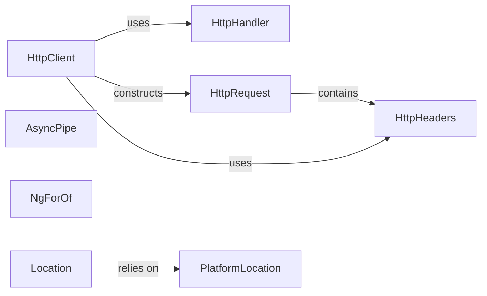

## Details

The Angular Common module provides fundamental building blocks for web applications, encompassing core functionalities like HTTP communication, URL management, and common structural directives and pipes. The `HttpClient` serves as the central component for all outgoing HTTP requests, leveraging `HttpRequest` to define request parameters and `HttpHeaders` for managing request headers. These requests are then dispatched through an `HttpHandler` chain, which can include interceptors for request/response transformation. For managing application navigation and URL interactions, the `Location` service offers a high-level abstraction, which in turn relies on the lower-level `PlatformLocation` to directly interact with the browser's native URL and history APIs. Additionally, the module includes essential templating utilities such as `AsyncPipe` for handling asynchronous data streams and `NgForOf` for efficient list rendering, enabling dynamic and responsive user interfaces. This interconnected set of components forms the backbone for common application features, ensuring a consistent and efficient development experience.

### HttpClient [[Expand]](./HttpClient.md)
The primary interface for making HTTP requests (GET, POST, PUT, DELETE, PATCH, HEAD, OPTIONS, JSONP). It abstracts the underlying XMLHttpRequest or Fetch API, provides methods for various response types (JSON, text, blob, arraybuffer), and integrates with the HTTP interceptor pipeline for request/response transformation.

**Related Classes/Methods**:

- <a href="https://github.com/angular/angular/blob/main/integration/platform-server/projects/ngmodule/src/app/http-transferstate-lazy-on-init/http-transferstate-lazy-on-init.component.ts" target="_blank" rel="noopener noreferrer">`HttpClient`</a>

### HttpRequest
Represents an immutable outgoing HTTP request. It holds all the necessary information for a request, including the HTTP method, URL, request body, headers, and other configuration options.

**Related Classes/Methods**:

- <a href="https://github.com/angular/angular/blob/main/packages/platform-server/src/types.d.ts" target="_blank" rel="noopener noreferrer">`HttpRequest`</a>

### HttpHandler [[Expand]](./HttpHandler.md)
Responsible for dispatching HTTP requests to the backend or to the next interceptor in the chain. It forms a crucial part of the HTTP client's extensible pipeline.

**Related Classes/Methods**:

- <a href="https://github.com/angular/angular/blob/main/packages/common/http/src/backend.ts#L148-L151" target="_blank" rel="noopener noreferrer">`HttpHandler`:148-151</a>

### HttpHeaders
Provides an API for managing HTTP headers. It allows for adding, setting, appending, and retrieving header values, handling multiple values for the same header.

**Related Classes/Methods**:

- <a href="https://github.com/angular/angular/blob/main/packages/common/http/src/headers.ts#L22-L273" target="_blank" rel="noopener noreferrer">`HttpHeaders`:22-273</a>

### AsyncPipe
A built-in Angular pipe that automatically subscribes to an Observable or Promise and unwraps its emitted values. It handles subscription and unsubscription lifecycle, updating the view when new values arrive.

**Related Classes/Methods**:

- <a href="https://github.com/angular/angular/blob/main/packages/common/src/pipes/async_pipe.ts#L138-L241" target="_blank" rel="noopener noreferrer">`AsyncPipe`:138-241</a>

### NgForOf
A structural directive that iterates over a collection (e.g., an array) and renders a template for each item. It efficiently manages the DOM by adding, removing, and reordering elements as the underlying collection changes.

**Related Classes/Methods**:

- <a href="https://github.com/angular/angular/blob/main/packages/common/src/directives/ng_for_of.ts" target="_blank" rel="noopener noreferrer">`NgForOf`</a>

### Location
Provides a high-level service for interacting with the browser's URL and history. It allows for navigation, getting the current URL, and listening for URL changes, abstracting away direct browser API manipulation.

**Related Classes/Methods**:

- <a href="https://github.com/angular/angular/blob/main/packages/platform-server/src/http.ts" target="_blank" rel="noopener noreferrer">`Location`</a>

### PlatformLocation
A low-level service that provides direct access to the browser's native URL and history APIs (e.g., window.location, window.history). It serves as the foundational layer for Angular's higher-level Location service.

**Related Classes/Methods**:

- <a href="https://github.com/angular/angular/blob/main/packages/platform-server/src/http.ts" target="_blank" rel="noopener noreferrer">`PlatformLocation`</a>

### [FAQ](https://github.com/CodeBoarding/GeneratedOnBoardings/tree/main?tab=readme-ov-file#faq)