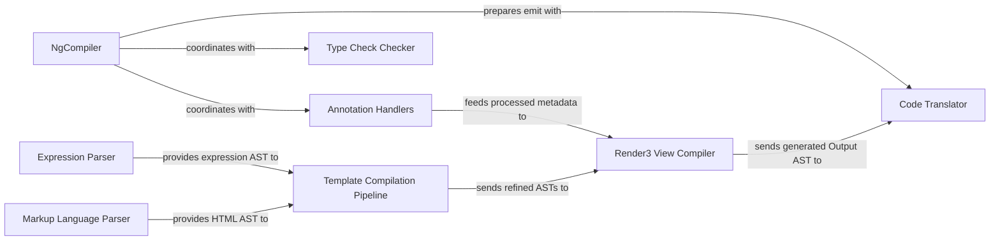

## Details

The Angular compiler is a sophisticated system designed to transform Angular source code into optimized JavaScript. At its core, the `NgCompiler` orchestrates the entire compilation process, from initial source code analysis to the final code emission. It leverages specialized components like `Annotation Handlers` to interpret Angular-specific metadata, `Markup Language Parser` and `Expression Parser` for template and expression parsing, and the `Type Check Checker` for ensuring type safety. The parsed and analyzed information then flows into the `Template Compilation Pipeline` and `Render3 View Compiler` to generate low-level rendering instructions, which are finally translated into executable JavaScript by the `Code Translator`. This modular design allows for efficient and robust compilation, with clear separation of concerns among its key components.

### NgCompiler
Acts as the central orchestrator, managing the overall compilation flow from source code input to optimized JavaScript output. It coordinates various sub-components, handles diagnostics, and prepares the emit phase.

**Related Classes/Methods**:

- <a href="https://github.com/angular/angular/blob/main/packages/compiler-cli/src/ngtsc/core/src/compiler.ts#L359-L1703" target="_blank" rel="noopener noreferrer">`packages.compiler-cli.src.ngtsc.core.src.compiler.NgCompiler`:359-1703</a>

### Annotation Handlers
Interprets and processes metadata from Angular-specific decorators (e.g., @Component, @NgModule, @Directive). This metadata is crucial for understanding the structure and behavior of Angular constructs.

**Related Classes/Methods**:

- <a href="https://github.com/angular/angular/blob/main/packages/compiler-cli/src/ngtsc/annotations" target="_blank" rel="noopener noreferrer">`packages.compiler-cli.src.ngtsc.annotations`</a>

### Type Check Checker
Performs static analysis and type checking of Angular templates and host bindings, ensuring type safety and catching potential errors early in the build process.

**Related Classes/Methods**:

- <a href="https://github.com/angular/angular/blob/main/packages/compiler-cli/src/ngtsc/typecheck/src/checker.ts" target="_blank" rel="noopener noreferrer">`packages.compiler-cli.src.ngtsc.typecheck.src.checker.TypeCheckChecker`</a>

### Markup Language Parser
Parses HTML and XML templates into an Abstract Syntax Tree (AST), providing a structured representation of the template content.

**Related Classes/Methods**:

- <a href="https://github.com/angular/angular/blob/main/packages/compiler/src/ml_parser" target="_blank" rel="noopener noreferrer">`packages.compiler.src.ml_parser`</a>

### Expression Parser
Parses Angular template expressions (e.g., {{ value }} for interpolation, (event)="handler()" for event binding) into an AST.

**Related Classes/Methods**:

- <a href="https://github.com/angular/angular/blob/main/packages/compiler/src/expression_parser" target="_blank" rel="noopener noreferrer">`packages.compiler.src.expression_parser`</a>

### Template Compilation Pipeline
A modern, modular pipeline designed for transforming Angular HTML templates into Render3 instructions through multiple, distinct phases.

**Related Classes/Methods**:

- <a href="https://github.com/angular/angular/blob/main/packages/compiler/src/template/pipeline/src" target="_blank" rel="noopener noreferrer">`packages.compiler.src.template.pipeline.src`</a>

### Render3 View Compiler
Generates low-level Render3 instructions (opcodes) for components and directives. These instructions define how components and templates behave at runtime.

**Related Classes/Methods**:

- <a href="https://github.com/angular/angular/blob/main/packages/compiler/src/render3/view/compiler.ts" target="_blank" rel="noopener noreferrer">`packages.compiler.src.render3.view.compiler.Render3ViewCompiler`</a>

### Code Translator
Translates the compiler's internal intermediate representation (Output AST) into the final JavaScript or TypeScript code, including declaration files and source maps. This is the final code emission step.

**Related Classes/Methods**:

- <a href="https://github.com/angular/angular/blob/main/packages/compiler-cli/src/ngtsc/translator" target="_blank" rel="noopener noreferrer">`packages.compiler-cli.src.ngtsc.translator`</a>

### [FAQ](https://github.com/CodeBoarding/GeneratedOnBoardings/tree/main?tab=readme-ov-file#faq)