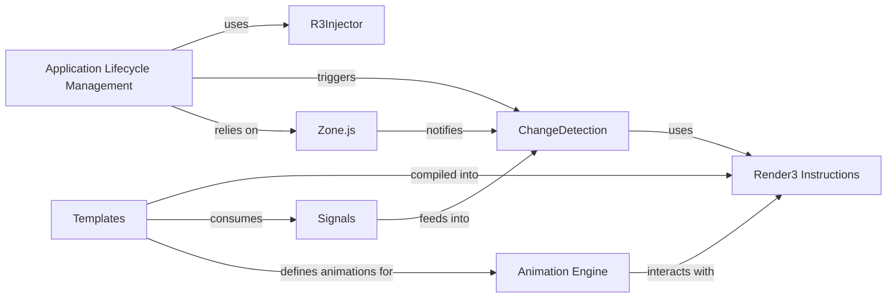

## Details

The Angular runtime core is structured around key components that manage application lifecycle, dependency injection, reactivity, and efficient UI rendering. The `Application Lifecycle Management` component orchestrates the bootstrapping process and overall application flow, relying on `R3Injector` for dependency resolution and `Zone.js` for consistent asynchronous execution contexts that trigger change detection. User interfaces, defined in `Templates`, are transformed into highly optimized `Render3 Instructions` by the Angular compiler, which are then utilized by `ChangeDetection` to efficiently update the DOM. `Signals` provide a modern, fine-grained reactivity primitive, feeding directly into `ChangeDetection` to ensure UI updates reflect the latest application state. The `Animation Engine` works in concert with `Render3 Instructions` to power declarative animations, with animation definitions embedded within `Templates`.

### Application Lifecycle Management
Manages the Angular platform and the overall lifecycle of a running Angular application, serving as the entry point for bootstrapping and orchestrating the root component and change detection cycles.

**Related Classes/Methods**:

- <a href="https://github.com/angular/angular/blob/main/packages/core/src/platform/platform_ref.ts" target="_blank" rel="noopener noreferrer">`packages/core/src/platform/platform_ref.ts`</a>
- <a href="https://github.com/angular/angular/blob/main/packages/core/src/application/application_ref.ts" target="_blank" rel="noopener noreferrer">`packages/core/src/application/application_ref.ts`</a>

### R3Injector
The core implementation of Angular's dependency injection system, responsible for resolving and providing instances of services and other dependencies throughout the application.

**Related Classes/Methods**:

- <a href="https://github.com/angular/angular/blob/main/packages/core/src/di/r3_injector.ts" target="_blank" rel="noopener noreferrer">`packages/core/src/di/r3_injector.ts`</a>

### ChangeDetection
The mechanism that detects changes in application data and efficiently updates the corresponding parts of the UI to reflect the new state.

**Related Classes/Methods**:

- <a href="https://github.com/angular/angular/blob/main/packages/core/src/render3/instructions/change_detection.ts" target="_blank" rel="noopener noreferrer">`packages/core/src/render3/instructions/change_detection.ts`</a>

### Render3 Instructions
Low-level, highly optimized instructions that directly manipulate the DOM, forming the core of Angular's rendering engine (Ivy). These instructions are generated by the Angular compiler from templates.

**Related Classes/Methods**:

- <a href="https://github.com/angular/angular/blob/main/packages/core/src/render3/instructions/element.ts" target="_blank" rel="noopener noreferrer">`packages/core/src/render3/instructions/element.ts`</a>
- <a href="https://github.com/angular/angular/blob/main/packages/core/src/render3/instructions/property.ts" target="_blank" rel="noopener noreferrer">`packages/core/src/render3/instructions/property.ts`</a>
- <a href="https://github.com/angular/angular/blob/main/packages/core/src/render3/instructions/listener.ts" target="_blank" rel="noopener noreferrer">`packages/core/src/render3/instructions/listener.ts`</a>

### Signals
Angular's modern reactivity primitive, providing a fine-grained, push-based change detection mechanism for reactive programming and efficient UI updates.

**Related Classes/Methods**:

- <a href="https://github.com/angular/angular/blob/main/packages/core/src/render3/reactivity/signal.ts" target="_blank" rel="noopener noreferrer">`packages/core/src/render3/reactivity/signal.ts`</a>
- <a href="https://github.com/angular/angular/blob/main/packages/core/src/render3/reactivity/computed.ts" target="_blank" rel="noopener noreferrer">`packages/core/src/render3/reactivity/computed.ts`</a>

### Zone.js
A library that patches asynchronous browser APIs (like `setTimeout`, `XMLHttpRequest`, event listeners) to provide a consistent execution context, enabling Angular's automatic change detection.

**Related Classes/Methods**:

- <a href="https://github.com/angular/angular/blob/main/packages/zone.js/lib/zone-impl.ts" target="_blank" rel="noopener noreferrer">`packages/zone.js/lib/zone-impl.ts`</a>

### Animation Engine
The underlying system that powers Angular's declarative animation capabilities, allowing developers to define complex UI transitions and effects.

**Related Classes/Methods**:

- <a href="https://github.com/angular/angular/blob/main/packages/animations/browser/src/create_engine.ts" target="_blank" rel="noopener noreferrer">`packages/animations/browser/src/create_engine.ts`</a>
- <a href="https://github.com/angular/angular/blob/main/packages/animations/browser/src/render/timeline_animation_engine.ts" target="_blank" rel="noopener noreferrer">`packages/animations/browser/src/render/timeline_animation_engine.ts`</a>

### Templates
The declarative HTML-based structures and associated metadata (e.g., component decorators) defined by developers that describe the UI of Angular components. These are processed by the Angular compiler and transformed into `Render3 Instructions`.

**Related Classes/Methods**: _None_

### [FAQ](https://github.com/CodeBoarding/GeneratedOnBoardings/tree/main?tab=readme-ov-file#faq)