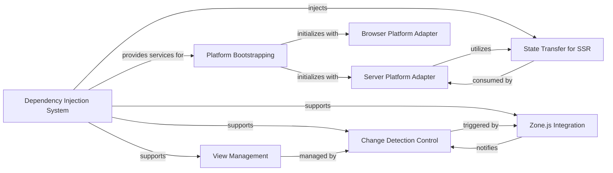

## Details

The Angular core subsystem is a sophisticated framework designed for building dynamic web applications, emphasizing modularity, reactivity, and efficient UI updates. At its heart, the Dependency Injection System facilitates the structured provision and management of application-wide services and components, promoting a decoupled architecture. This system is crucial for initializing and configuring the application environment, particularly during Platform Bootstrapping, which adapts Angular to specific execution environments like browsers or servers. The framework's reactivity is largely driven by the Change Detection Control and its integration with Zone.js Integration. Zone.js intercepts asynchronous operations, notifying Angular to trigger change detection cycles, ensuring the UI remains synchronized with the application state. The View Management component provides a low-level interface for interacting with the rendered UI, allowing Angular to efficiently update the DOM based on detected changes. For Server-Side Rendering (SSR), the Server Platform Adapter works in conjunction with State Transfer for SSR to pre-render applications on the server and seamlessly transfer the application state to the client, optimizing initial load times and SEO.

### Dependency Injection System [[Expand]](./Dependency_Injection_System.md)
Manages the creation, resolution, and lifecycle of injectable instances (services, components, directives).

**Related Classes/Methods**:

- <a href="https://github.com/angular/angular/blob/main/packages/core/src/di/injector.ts" target="_blank" rel="noopener noreferrer">`angular.core.di.Injector`</a>

### View Management [[Expand]](./View_Management.md)
Represents an Angular view, offering an API to interact with its lifecycle and trigger change detection.

**Related Classes/Methods**:

- <a href="https://github.com/angular/angular/blob/main/packages/core/src/render3/view_ref.ts" target="_blank" rel="noopener noreferrer">`angular.core.render3.ViewRef`</a>

### Change Detection Control
Provides a programmatic interface to control the change detection cycle for a component's view.

**Related Classes/Methods**:

- <a href="https://github.com/angular/angular/blob/main/packages/core/src/change_detection/change_detector_ref.ts" target="_blank" rel="noopener noreferrer">`angular.core.change_detection.ChangeDetectorRef`</a>

### Platform Bootstrapping [[Expand]](./Platform_Bootstrapping.md)
Acts as the primary entry point for initializing Angular applications and managing the platform-specific environment.

**Related Classes/Methods**:

- <a href="https://github.com/angular/angular/blob/main/packages/core/src/platform/platform.ts" target="_blank" rel="noopener noreferrer">`angular.core.platform.Platform`</a>

### Browser Platform Adapter
Provides the browser-specific implementation of the Angular platform, handling DOM manipulation, event handling, and bootstrapping for browser environments.

**Related Classes/Methods**:

### Server Platform Adapter
Provides the server-side rendering (SSR) implementation of the Angular platform, including DOM emulation and rendering to a string for server environments.

**Related Classes/Methods**:

- <a href="https://github.com/angular/angular/blob/main/packages/platform-server/src/server.ts" target="_blank" rel="noopener noreferrer">`angular.platform_server.ServerModule`</a>

### Zone.js Integration [[Expand]](./Zone_js_Integration.md)
Integrates Zone.js with Angular, enabling automatic change detection by tracking asynchronous operations and notifying Angular when they complete.

**Related Classes/Methods**:

- <a href="https://github.com/angular/angular/blob/main/packages/core/src/zone/ng_zone.ts" target="_blank" rel="noopener noreferrer">`angular.core.zone.NgZone`</a>

### State Transfer for SSR
Manages a key-value store for transferring application state from the server to the client during SSR, preventing redundant data fetching and improving perceived performance.

**Related Classes/Methods**:

### [FAQ](https://github.com/CodeBoarding/GeneratedOnBoardings/tree/main?tab=readme-ov-file#faq)