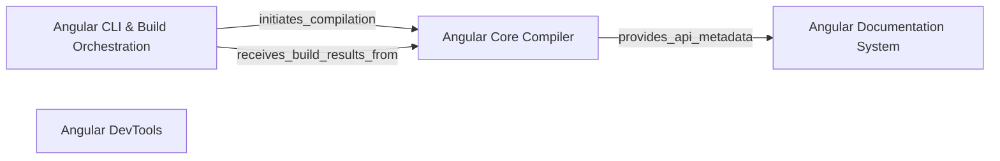

## Details

The Angular ecosystem's core functionality is driven by a symbiotic relationship between the Angular CLI & Build Orchestration and the Angular Core Compiler. The CLI acts as the primary user interface, interpreting developer commands and orchestrating the build process. It delegates the complex task of code transformation and optimization to the Angular Core Compiler, which then returns the compiled artifacts and build results back to the CLI for reporting. Complementing this build pipeline, the Angular Documentation System processes compiler-generated metadata and other source content to produce comprehensive documentation, while the Angular DevTools provide runtime inspection and debugging capabilities for applications built by this system.

### Angular CLI & Build Orchestration [[Expand]](./Angular_CLI_Build_Orchestration.md)
This component serves as the primary interface for developers to interact with the Angular build system. It is responsible for parsing command-line arguments, loading project configurations (e.g., `angular.json`), and orchestrating the overall compilation and development server processes. It initiates build tasks, manages watch mode for incremental compilation, and reports build outcomes (success, errors, warnings) back to the developer.

**Related Classes/Methods**:

- <a href="https://github.com/angular/angular/blob/main/packages/compiler-cli/src/bin/ngc.ts" target="_blank" rel="noopener noreferrer">`ngc`</a>

### Angular Core Compiler [[Expand]](./Angular_Core_Compiler.md)
This is the intellectual core of the Angular build process, responsible for transforming Angular application source code (TypeScript, HTML templates, CSS) into optimized JavaScript bundles. It performs static analysis, type checking, processes Angular-specific decorators (`@Component`, `@NgModule`) and templates, and generates the final executable code, declaration files, and source maps. It includes the TypeScript program creation, Angular-specific transformations (`ngtsc`), and code emission.

**Related Classes/Methods**:

- <a href="https://github.com/angular/angular/blob/main/integration/nodenext_resolution/include-all.ts" target="_blank" rel="noopener noreferrer">`compiler`</a>

### Angular Documentation System
This component manages the generation and rendering of both conceptual guides (e.g., tutorials, how-to's) and API reference documentation for Angular. It processes various source content formats (e.g., Markdown for guides, JSDoc/TSDoc comments for API) and transforms them into structured, web-ready formats for the official Angular documentation website.

**Related Classes/Methods**:

- <a href="https://github.com/angular/angular/blob/main/adev/shared-docs/components/index.ts" target="_blank" rel="noopener noreferrer">`adev.shared_docs.components.index`</a>

### Angular DevTools
This component provides a suite of debugging and profiling tools for Angular applications, typically integrated as a browser extension. It allows developers to inspect component trees, monitor performance, and debug application state at runtime. It encompasses the DevTools user interface, the backend communication logic injected into the application, and the message bus facilitating communication between the frontend and backend.

**Related Classes/Methods**:

- <a href="https://github.com/angular/angular/blob/main/devtools/projects/ng-devtools/src/lib/devtools-tabs/devtools_tabs.component.ts" target="_blank" rel="noopener noreferrer">`devtools.projects.ng_devtools.src.lib.devtools_tabs.devtools_tabs.component`</a>

### [FAQ](https://github.com/CodeBoarding/GeneratedOnBoardings/tree/main?tab=readme-ov-file#faq)