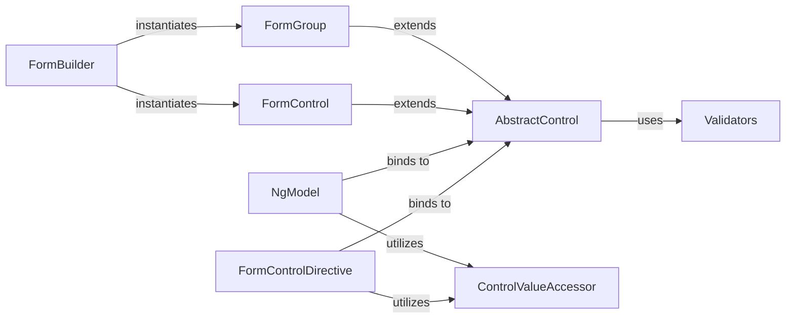

## Details

The Angular Forms architecture is centered on a hierarchical model rooted in `AbstractControl`, which provides a consistent API for managing form state. `FormControl` and `FormGroup` are concrete implementations of `AbstractControl`, representing individual inputs and collections of controls, respectively. The `FormBuilder` service streamlines the creation of these form structures. Interaction between the form model and the UI is facilitated by directives like `NgModel` and `FormControlDirective`, which rely on the `ControlValueAccessor` interface to abstract away DOM manipulation. Validation is handled by the `Validators` utility, offering a set of reusable validation functions that can be applied to any `AbstractControl`. This design promotes modularity, testability, and a clear separation of concerns between the form's data model and its presentation.

### AbstractControl [[Expand]](./AbstractControl.md)
The foundational abstract class for all form controls, defining the common API and state management (e.g., `value`, `status`, `valid`, `dirty`). It serves as the base for individual controls and groups of controls.

**Related Classes/Methods**:

- <a href="https://github.com/angular/angular/blob/main/packages/forms/src/model/abstract_model.ts#L468-L1767" target="_blank" rel="noopener noreferrer">`AbstractControl`:468-1767</a>

### FormControl [[Expand]](./FormControl.md)
Represents an individual input field's value and validation status. It is the most granular unit in the forms model.

**Related Classes/Methods**:

- <a href="https://github.com/angular/angular/blob/main/packages/forms/src/model/form_control.ts#L193-L359" target="_blank" rel="noopener noreferrer">`FormControl`:193-359</a>

### FormGroup [[Expand]](./FormGroup.md)
Manages a collection of `AbstractControl` instances (e.g., `FormControl`, `FormGroup`, `FormArray`) as a single unit, aggregating their values and validation status.

**Related Classes/Methods**:

- <a href="https://github.com/angular/angular/blob/main/packages/forms/src/directives/form_interface.ts" target="_blank" rel="noopener noreferrer">`FormGroup`</a>

### FormBuilder [[Expand]](./FormBuilder.md)
A service that provides a convenient API for programmatically creating instances of `FormControl`, `FormGroup`, and `FormArray`, simplifying the setup of complex reactive forms.

**Related Classes/Methods**:

- <a href="https://github.com/angular/angular/blob/main/packages/forms/src/form_builder.ts#L139-L407" target="_blank" rel="noopener noreferrer">`FormBuilder`:139-407</a>

### NgModel [[Expand]](./NgModel.md)
A directive used in template-driven forms that creates an implicit `FormControl` instance for a DOM element and establishes two-way data binding between the element and the form model.

**Related Classes/Methods**:

- <a href="https://github.com/angular/angular/blob/main/packages/forms/src/directives/ng_model.ts#L161-L374" target="_blank" rel="noopener noreferrer">`NgModel`:161-374</a>

### FormControlDirective
A directive used in reactive forms that explicitly links an existing `FormControl` instance from the component's class to a specific DOM element in the template.

**Related Classes/Methods**:

- <a href="https://github.com/angular/angular/blob/main/packages/forms/src/directives/reactive_directives/form_control_directive.ts#L74-L207" target="_blank" rel="noopener noreferrer">`FormControlDirective`:74-207</a>

### ControlValueAccessor
An interface that defines how form controls interact with native DOM elements or custom components, bridging the model and view by providing methods for writing values to the view and registering change/touch callbacks.

**Related Classes/Methods**:

- <a href="https://github.com/angular/angular/blob/main/packages/forms/src/directives/control_value_accessor.ts#L141-L193" target="_blank" rel="noopener noreferrer">`ControlValueAccessor`:141-193</a>

### Validators
A collection of static methods that provide common validation patterns (e.g., `required`, `minLength`, `pattern`) for form controls.

**Related Classes/Methods**:

- <a href="https://github.com/angular/angular/blob/main/.ng-dev/pull-request.mts#L21-L24" target="_blank" rel="noopener noreferrer">`Validators`:21-24</a>

### [FAQ](https://github.com/CodeBoarding/GeneratedOnBoardings/tree/main?tab=readme-ov-file#faq)