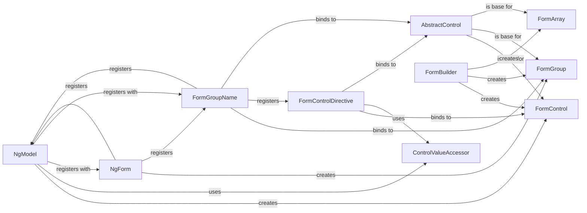

## Details

The Angular Forms subsystem provides a robust framework for managing user input and validating data. It is primarily composed of a hierarchical model of form controls and directives that bridge these models with the DOM. The core of the subsystem revolves around `AbstractControl` and its concrete implementations: `FormControl`, `FormGroup`, and `FormArray`. The `FormBuilder` acts as a utility for programmatically creating these control structures. Interaction with the DOM is facilitated by directives like `NgModel` (for template-driven forms) and `FormControlDirective`, `FormGroupName` (for reactive forms), which leverage the `ControlValueAccessor` interface to standardize communication with native form elements.

### AbstractControl
The foundational abstract class for all form controls (`FormControl`, `FormGroup`, `FormArray`). It defines the common properties (value, status, errors) and methods for tracking the state and validity of a form element or group.

**Related Classes/Methods**:

- <a href="https://github.com/angular/angular/blob/main/packages/forms/src/model/abstract_model.ts#L1-L99999" target="_blank" rel="noopener noreferrer">`AbstractControl`:1-99999</a>

### FormControl
Represents a single form control, typically an input field. It tracks the value, user interaction (touched, dirty), and validation status of an individual form element.

**Related Classes/Methods**:

- <a href="https://github.com/angular/angular/blob/main/packages/forms/src/directives/reactive_errors.ts#L34-L42" target="_blank" rel="noopener noreferrer">`FormControl`:34-42</a>

### FormGroup
Represents a collection of `FormControl` instances (or other `FormGroup`/`FormArray` instances), aggregating their values into a single object and calculating the overall group's status.

**Related Classes/Methods**:

- <a href="https://github.com/angular/angular/blob/main/adev/src/content/examples/dynamic-form/src/app/question-control.service.ts#L9-L18" target="_blank" rel="noopener noreferrer">`FormGroup`:9-18</a>

### FormArray
Represents a dynamic array of `AbstractControl` instances, aggregating their values into an array and calculating the overall array's status.

**Related Classes/Methods**:

- <a href="https://github.com/angular/angular/blob/main/packages/examples/forms/ts/nestedFormArray/nested_form_array_example.ts#L14-L52" target="_blank" rel="noopener noreferrer">`FormArray`:14-52</a>

### FormBuilder
A service designed to simplify the creation of `AbstractControl` instances (`FormControl`, `FormGroup`, `FormArray`) programmatically, primarily used in reactive forms.

**Related Classes/Methods**:

- <a href="https://github.com/angular/angular/blob/main/adev/src/content/examples/reactive-forms/src/app/profile-editor/profile-editor.component.2.ts" target="_blank" rel="noopener noreferrer">`FormBuilder`</a>

### NgModel
A directive central to template-driven forms, enabling two-way data binding between a form input element and a component property. It implicitly creates and manages a `FormControl` instance for the bound element.

**Related Classes/Methods**:

- <a href="https://github.com/angular/angular/blob/main/packages/upgrade/src/common/src/downgrade_component.ts" target="_blank" rel="noopener noreferrer">`NgModel`</a>

### ControlValueAccessor
A key interface that defines how Angular forms interact with a DOM element. Implementations provide concrete logic for reading and writing values to specific input types (e.g., text inputs, selects, checkboxes).

**Related Classes/Methods**:

- <a href="https://github.com/angular/angular/blob/main/packages/forms/src/directives/select_multiple_control_value_accessor.ts#L82-L199" target="_blank" rel="noopener noreferrer">`ControlValueAccessor`:82-199</a>

### NgForm
A directive that automatically creates a top-level `FormGroup` instance for a `<form>` element in template-driven forms. It tracks the overall state of the form (validity, dirty, touched, submitted).

**Related Classes/Methods**:

- <a href="https://github.com/angular/angular/blob/main/packages/forms/src/directives/ng_form.ts#L125-L382" target="_blank" rel="noopener noreferrer">`NgForm`:125-382</a>

### FormControlDirective
Binds an existing `FormControl` instance (created programmatically, e.g., via `FormBuilder`) from a component class to a DOM input element, used in reactive forms.

**Related Classes/Methods**:

- <a href="https://github.com/angular/angular/blob/main/packages/forms/src/directives/reactive_directives/form_control_directive.ts#L74-L207" target="_blank" rel="noopener noreferrer">`FormControlDirective`:74-207</a>

### FormGroupName
Binds an existing `FormGroup` instance to a DOM element, allowing for nested form groups within reactive forms.

**Related Classes/Methods**:

- <a href="https://github.com/angular/angular/blob/main/packages/forms/src/directives/reactive_directives/form_group_name.ts#L85-L122" target="_blank" rel="noopener noreferrer">`FormGroupName`:85-122</a>

### [FAQ](https://github.com/CodeBoarding/GeneratedOnBoardings/tree/main?tab=readme-ov-file#faq)