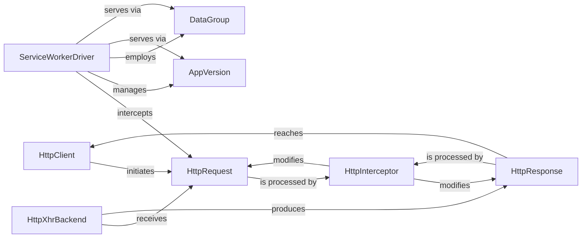

## Details

The Angular HTTP and Service Worker subsystems are designed for efficient and robust network communication and offline capabilities. The HttpClient serves as the primary interface for applications to initiate HTTP requests, encapsulating them within HttpRequest objects. These requests traverse an HttpInterceptor chain, allowing for global modification and processing before reaching the HttpXhrBackend, which handles the actual network transmission. Upon receiving a HttpResponse, it similarly passes through the interceptor chain before being returned to the HttpClient. Complementing this, the ServiceWorkerDriver acts as a central orchestrator for offline experiences, intercepting network requests and managing cached application versions via AppVersion and dynamic data through DataGroup configurations, ensuring optimal performance and reliability even in disconnected environments.

### HttpClient
The primary high-level API for making HTTP requests (GET, POST, PUT, DELETE) from Angular applications. It abstracts the underlying network communication and integrates with the interceptor chain.

**Related Classes/Methods**:

- <a href="https://github.com/angular/angular/blob/main/integration/platform-server/projects/standalone/src/app/http-transferstate-lazy-on-init/http-transfer-state-on-init.component.ts" target="_blank" rel="noopener noreferrer">`HttpClient`</a>

### HttpInterceptor
A mechanism to intercept and modify outgoing HTTP requests and incoming responses. This allows for cross-cutting concerns such as authentication, logging, or error handling to be applied globally.

**Related Classes/Methods**:

- <a href="https://github.com/angular/angular/blob/main/packages/common/http/src/interceptor.ts#L57-L66" target="_blank" rel="noopener noreferrer">`HttpInterceptor`:57-66</a>

### HttpRequest
An immutable object representing an outgoing HTTP request. It encapsulates all details of the request, including the URL, method, headers, and body.

**Related Classes/Methods**:

- <a href="https://github.com/angular/angular/blob/main/packages/platform-server/src/types.d.ts" target="_blank" rel="noopener noreferrer">`HttpRequest`</a>

### HttpResponse
An immutable object representing an incoming HTTP response. It contains the response status, headers, and body, providing the result of an HTTP request.

**Related Classes/Methods**:

- <a href="https://github.com/angular/angular/blob/main/packages/common/http/src/transfer_cache.ts#L96-L109" target="_blank" rel="noopener noreferrer">`HttpResponse`:96-109</a>

### HttpXhrBackend
The low-level implementation that performs actual network communication using the browser's XMLHttpRequest API. It is responsible for sending the HttpRequest and receiving the raw HttpResponse.

**Related Classes/Methods**:

- <a href="https://github.com/angular/angular/blob/main/packages/common/http/src/xhr.ts#L122-L451" target="_blank" rel="noopener noreferrer">`HttpXhrBackend`:122-451</a>

### ServiceWorkerDriver
The core orchestrator for the Angular Service Worker. It manages the Service Worker's lifecycle, handles various events (e.g., fetch, message, push), and coordinates with AppVersion to serve cached assets and data.

**Related Classes/Methods**:

- <a href="https://github.com/angular/angular/blob/main/packages/service-worker/worker/src/driver.ts" target="_blank" rel="noopener noreferrer">`ServiceWorkerDriver`</a>

### AppVersion
Represents a specific version of the Angular application within the Service Worker's cache. It manages the caching strategies for static assets (e.g., JavaScript, CSS, images) associated with that application version.

**Related Classes/Methods**:

- <a href="https://github.com/angular/angular/blob/main/devtools/src/app/transfer-state.ts" target="_blank" rel="noopener noreferrer">`AppVersion`</a>

### DataGroup
Handles runtime caching strategies for dynamic data (e.g., API responses). It allows the Service Worker to cache and serve network requests based on configured rules, improving performance and offline capabilities.

**Related Classes/Methods**:

- <a href="https://github.com/angular/angular/blob/main/packages/service-worker/config/src/in.ts#L52-L65" target="_blank" rel="noopener noreferrer">`DataGroup`:52-65</a>

### [FAQ](https://github.com/CodeBoarding/GeneratedOnBoardings/tree/main?tab=readme-ov-file#faq)