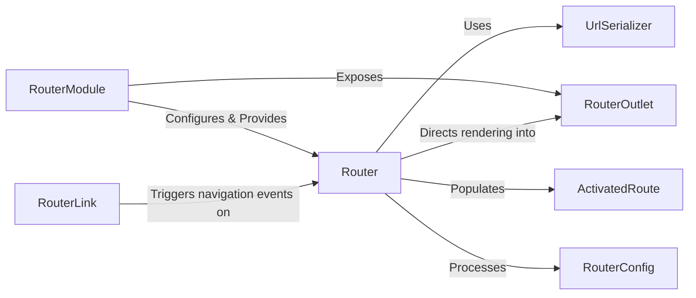

## Details

Revised analysis of the Angular Router subsystem, focusing on its core components, their responsibilities, and their interactions.

### RouterModule
The foundational Angular module that configures and bootstraps the routing infrastructure. It exposes core routing services and directives for use throughout the application.

**Related Classes/Methods**:

- <a href="https://github.com/angular/angular/blob/main/packages/router/src/router_module.ts#L108-L195" target="_blank" rel="noopener noreferrer">`RouterModule`:108-195</a>

### Router
The central service responsible for orchestrating navigation. It initiates navigation cycles, interacts with the browser's URL, and directs the rendering of components into RouterOutlets.

**Related Classes/Methods**:

- <a href="https://github.com/angular/angular/blob/main/integration/nodenext_resolution/include-all.ts" target="_blank" rel="noopener noreferrer">`Router`</a>

### RouterOutlet
A directive that serves as a placeholder in component templates, marking where the router should render activated components. It's the visual target for routed content.

**Related Classes/Methods**:

- <a href="https://github.com/angular/angular/blob/main/packages/router/src/directives/router_outlet.ts#L205-L409" target="_blank" rel="noopener noreferrer">`RouterOutlet`:205-409</a>

### ActivatedRoute
An injectable service providing access to information about the currently active route associated with a loaded component. This includes route parameters, query parameters, and static data.

**Related Classes/Methods**:

- <a href="https://github.com/angular/angular/blob/main/adev/src/app/app.component.ts" target="_blank" rel="noopener noreferrer">`ActivatedRoute`</a>

### UrlSerializer
A utility responsible for converting URL strings into a structured UrlTree (a tree of URL segments) for internal processing by the router, and vice-versa for URL generation.

**Related Classes/Methods**:

- <a href="https://github.com/angular/angular/blob/main/packages/router/src/router_scroller.ts" target="_blank" rel="noopener noreferrer">`UrlSerializer`</a>

### RouterConfig
An array of objects that define the mapping between URL paths and the components to be rendered. This configuration is the blueprint for the application's navigation structure.

**Related Classes/Methods**:

- <a href="https://github.com/angular/angular/blob/main/packages/router/src/models.ts#L762-L765" target="_blank" rel="noopener noreferrer">`RouterConfig`:762-765</a>

### [FAQ](https://github.com/CodeBoarding/GeneratedOnBoardings/tree/main?tab=readme-ov-file#faq)