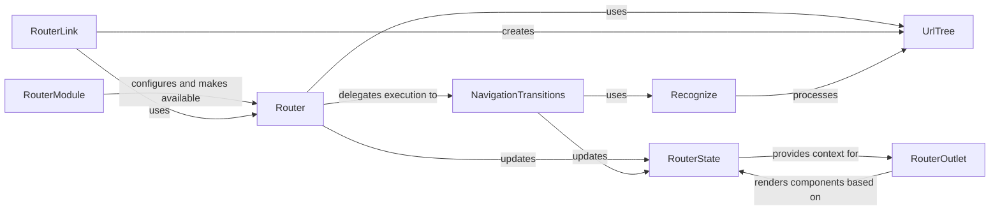

## Details

The `Angular Routing & Navigation` subsystem is responsible for managing navigation and state transitions within an Angular application, mapping URLs to components and handling route activation. Its core functionality revolves around interpreting URLs, matching them to defined routes, executing navigation guards, resolving data, and rendering the appropriate components.

### Router [[Expand]](./Router.md)
The primary orchestrator of the routing process. It initiates and manages the entire navigation lifecycle, serving as the main programmatic interface for navigation.

**Related Classes/Methods**:

- <a href="https://github.com/angular/angular/blob/main/packages/router/src/router.ts#L101-L690" target="_blank" rel="noopener noreferrer">`router.Router`:101-690</a>

### NavigationTransitions [[Expand]](./NavigationTransitions.md)
Manages the detailed steps of a navigation request, implementing the navigation pipeline. This includes executing guard checks, resolving data, and loading components.

**Related Classes/Methods**:

- <a href="https://github.com/angular/angular/blob/main/packages/router/src/router.ts" target="_blank" rel="noopener noreferrer">`router.NavigationTransitions`</a>

### UrlTree [[Expand]](./UrlTree.md)
Represents the parsed, canonical structure of a URL within the router. It enables programmatic manipulation and comparison of URL segments, query parameters, and fragments.

**Related Classes/Methods**:

- <a href="https://github.com/angular/angular/blob/main/packages/router/src/router.ts" target="_blank" rel="noopener noreferrer">`router.UrlTree`</a>

### RouterState
Represents the current state of the router, providing access to the activated route tree and its properties. It reflects the current navigation context, including activated routes, parameters, and data.

**Related Classes/Methods**:

- <a href="https://github.com/angular/angular/blob/main/packages/router/src/router.ts#L142-L144" target="_blank" rel="noopener noreferrer">`router.RouterState`:142-144</a>

### Recognize [[Expand]](./Recognize.md)
The core route matching engine. It matches a given `UrlTree` against the configured route definitions to determine the activated route hierarchy.

**Related Classes/Methods**:

- <a href="https://github.com/angular/angular/blob/main/packages/router/src/recognize.ts" target="_blank" rel="noopener noreferrer">`router.Recognize`</a>

### RouterOutlet [[Expand]](./RouterOutlet.md)
A structural directive that acts as a placeholder in the template where the router should render the component for the active route. It enables dynamic view composition based on the current URL.

**Related Classes/Methods**:

- <a href="https://github.com/angular/angular/blob/main/packages/router/src/directives/router_outlet.ts" target="_blank" rel="noopener noreferrer">`router.directives.RouterOutlet`</a>

### RouterLink
A directive that allows for declarative navigation within templates, transforming router commands into clickable links. It provides a user-friendly way to trigger navigation without programmatic calls.

**Related Classes/Methods**:

- <a href="https://github.com/angular/angular/blob/main/packages/router/src/directives/router_link.ts" target="_blank" rel="noopener noreferrer">`router.directives.RouterLink`</a>

### RouterModule [[Expand]](./RouterModule.md)
An Angular module that provides the necessary services, directives, and configuration for the Angular Router to function within an application. It is the entry point for integrating the router.

**Related Classes/Methods**:

- <a href="https://github.com/angular/angular/blob/main/packages/router/src/router_module.ts" target="_blank" rel="noopener noreferrer">`router.RouterModule`</a>

### [FAQ](https://github.com/CodeBoarding/GeneratedOnBoardings/tree/main?tab=readme-ov-file#faq)