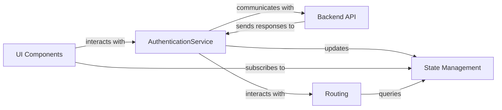

## Details

The authentication subsystem orchestrates user login, logout, and session management. UI Components initiate authentication requests by interacting with the AuthenticationService. The AuthenticationService then communicates with the Backend API to validate credentials and receive authentication tokens. Upon successful authentication, the AuthenticationService updates the State Management component, which holds the global authentication state. UI Components subscribe to State Management to dynamically update their display based on the user's authentication status. The Routing component also queries State Management to protect routes, ensuring that only authenticated users can access specific parts of the application, and redirects users appropriately after login or logout.

### AuthenticationService [[Expand]](./AuthenticationService.md)
Orchestrates user login, logout, and session management. Communicates with Backend API for authentication requests, updates State Management with authentication status, and interacts with Routing for navigation control.

**Related Classes/Methods**: _None_

### UI Components
Initiate authentication requests by interacting with the AuthenticationService and subscribe to State Management to dynamically update their display based on the user's authentication status.

**Related Classes/Methods**: _None_

### Backend API
Validates credentials and receives authentication tokens, sending responses to AuthenticationService.

**Related Classes/Methods**: _None_

### State Management
Holds the global authentication state, providing authentication state to UI Components and Routing.

**Related Classes/Methods**: _None_

### Routing
Queries State Management to protect routes, ensuring that only authenticated users can access specific parts of the application, and redirects users appropriately after login or logout.

**Related Classes/Methods**: _None_

### [FAQ](https://github.com/CodeBoarding/GeneratedOnBoardings/tree/main?tab=readme-ov-file#faq)