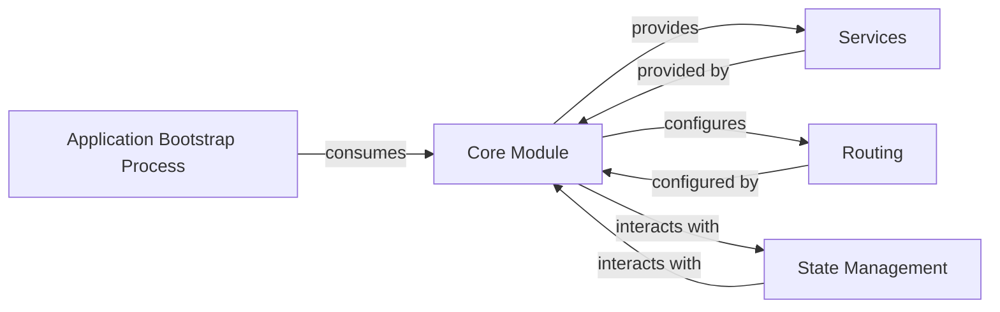

## Details

The Angular application's architecture is centered around a `Core Module` (represented by `app.config.ts`), which acts as the central configuration hub. This module is responsible for providing application-wide singleton services, configuring routing, and setting up global error handling. The `Application Bootstrap Process` (`main.ts`) initiates the application by consuming the configurations and providers defined in the `Core Module`. Services like `AnalyticsService` and `ContentLoader` are provided by the `Core Module` to ensure their singleton nature and availability throughout the application, encapsulating business logic and data fetching. Routing, managed by `routerProviders`, is also configured within the `Core Module` to define navigation paths. While explicit "State Management" components are not directly imported as a single module, the `Core Module` interacts with and provides mechanisms for managing global application state, such as environment variables and error handling through `CustomErrorHandler`, ensuring a centralized approach for critical application-wide concerns.

### Core Module [[Expand]](./Core_Module.md)
The Core Module, primarily represented by `app.config.ts` in modern Angular standalone applications, is the central hub for application-wide singleton services, global configurations, and foundational features. It ensures that services like authentication, logging, and error handling are instantiated only once and are available throughout the application. It also configures global aspects such as routing and HTTP interceptors, centralizing critical application setup.

**Related Classes/Methods**:

- <a href="https://github.com/angular/angular/blob/main/adev/src/app/app.config.ts" target="_blank" rel="noopener noreferrer">`app.config.ts`</a>

### Services [[Expand]](./Services.md)
These are application-wide singleton services (e.g., `AnalyticsService`, `ContentLoader`, `ExampleContentLoader`) that encapsulate business logic, data fetching, and specific application functionalities. They are provided by the Core Module to ensure their singleton nature and availability throughout the application.

**Related Classes/Methods**:

### Routing
This component defines and manages the application's navigation paths and view transitions. It's typically configured within the Core Module using mechanisms like `provideRouter` and `routerProviders`, ensuring a consistent navigation experience across the application.

**Related Classes/Methods**:

### Application Bootstrap Process
This process, typically initiated in `main.ts`, is responsible for the initial loading and setup of the Angular application. It consumes the configurations and providers defined by the Core Module to initialize the application's root environment.

**Related Classes/Methods**:

- <a href="https://github.com/angular/angular/blob/main/adev/src/main.ts" target="_blank" rel="noopener noreferrer">`main.ts`</a>

### State Management
This component represents the system or pattern used for managing global application state. While it can be handled locally within components or through services, its interaction with the Core Module suggests a centralized approach for critical application-wide state, particularly for environment configurations and error handling.

**Related Classes/Methods**:

### [FAQ](https://github.com/CodeBoarding/GeneratedOnBoardings/tree/main?tab=readme-ov-file#faq)