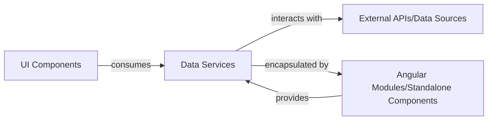

## Details

The `adev` application follows a client-server architecture where the Angular frontend interacts with external APIs and data sources. The core of the frontend is organized around `Data Services` which abstract data access and business logic, providing a clean interface for `UI Components`. These `UI Components` are responsible for rendering the user interface and handling user interactions, consuming data provided by the `Data Services`. The entire application structure, including the provision of `Data Services` and the declaration of `UI Components`, is managed by `Angular Modules/Standalone Components`, which leverage Angular's dependency injection system to make services available throughout the application. This setup ensures a modular and maintainable codebase, separating concerns between data handling, UI presentation, and application configuration.

Critical Interaction Pathways:
1.  `UI Components` initiate requests for data or actions, which are then delegated to `Data Services`.
2.  `Data Services` communicate with `External APIs/Data Sources` to retrieve or send data.
3.  `External APIs/Data Sources` respond to `Data Services` with the requested information.
4.  `Data Services` process the raw data and provide it to `UI Components` for display.
5.  `Angular Modules/Standalone Components` configure and provide `Data Services` to `UI Components` through dependency injection.

### Data Services [[Expand]](./Data_Services.md)
These services encapsulate the business logic and data access operations for specific entities or domains within the application. They abstract the communication with backend APIs or local data sources, providing a clean, reusable, and injectable interface for UI components to interact with and retrieve application data. They often handle data fetching, transformation, and caching.

**Related Classes/Methods**:

- <a href="https://github.com/angular/angular/blob/main/adev/src/app/core/services/content-loader.service.ts" target="_blank" rel="noopener noreferrer">`ContentLoaderService`</a>

### UI Components
These are Angular components responsible for rendering the user interface. They consume data and invoke business logic provided by `Data Services` to display information and handle user interactions. They represent the "View" aspect in an MVVM-like pattern.

**Related Classes/Methods**:

### External APIs/Data Sources
These represent external systems, databases, or third-party services that provide the raw data consumed by the application. `Data Services` interact directly with these sources to fetch, send, or manipulate data.

**Related Classes/Methods**: _None_

### Angular Modules/Standalone Components
In Angular, modules (or standalone components in newer versions) are used to organize the application into cohesive blocks of functionality. They declare, import, and export components, services, and other artifacts. For `Data Services`, modules are crucial for providing these services through Angular's dependency injection system, making them available to other parts of the application.

**Related Classes/Methods**:

### [FAQ](https://github.com/CodeBoarding/GeneratedOnBoardings/tree/main?tab=readme-ov-file#faq)