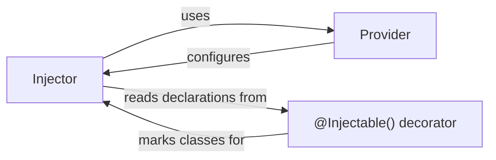

## Details

The `Dependency Injection System` subsystem in Angular is responsible for managing the creation, resolution, and lifecycle of injectable instances (services, components, directives). It acts as the core mechanism for providing dependencies throughout the application, promoting modularity and testability.

### Injector
The core runtime mechanism responsible for resolving and providing dependencies. It maintains a collection of providers and instantiates dependencies as needed.

**Related Classes/Methods**:

- <a href="https://github.com/angular/angular/blob/main/integration/ng_elements/src/app.ts" target="_blank" rel="noopener noreferrer">`Injector`</a>

### Provider
A configuration object that instructs the `Injector` on how to obtain a value for a specific dependency token. Providers define the "recipe" for creating or providing an instance.

**Related Classes/Methods**:

- <a href="https://github.com/angular/angular/blob/main/packages/forms/src/directives/ng_model_group.ts#L30-L33" target="_blank" rel="noopener noreferrer">`Provider`:30-33</a>

### @Injectable() decorator
A decorator that marks a class as a service that can be injected by the Angular DI system. It can also be used to configure providers for the decorated class.

**Related Classes/Methods**:

- <a href="https://github.com/angular/angular/blob/main/packages/compiler-cli/linker/src/file_linker/partial_linkers/partial_linker_selector.ts" target="_blank" rel="noopener noreferrer">`Injectable`</a>

### [FAQ](https://github.com/CodeBoarding/GeneratedOnBoardings/tree/main?tab=readme-ov-file#faq)