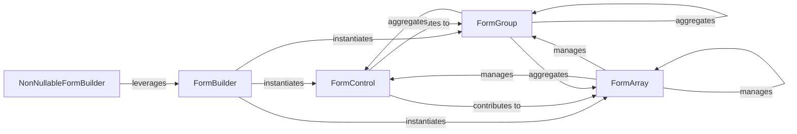

## Details

The FormBuilder subsystem is responsible for the programmatic construction and management of reactive forms within Angular. It provides a high-level API to create instances of form controls, groups, and arrays, forming the structural foundation for user input and validation.

### FormBuilder [[Expand]](./FormBuilder.md)
The primary factory service for programmatically creating instances of FormControl, FormGroup, and FormArray, simplifying the setup of complex reactive forms. It acts as the entry point for defining form structures in code.

**Related Classes/Methods**:

- <a href="https://github.com/angular/angular/blob/main/packages/forms/src/form_builder.ts#L139-L407" target="_blank" rel="noopener noreferrer">`FormBuilder`:139-407</a>

### FormControl [[Expand]](./FormControl.md)
Represents a single input field within a reactive form, managing its value, validation status, and user interaction. It is the most granular unit of a form.

**Related Classes/Methods**:

- <a href="https://github.com/angular/angular/blob/main/packages/forms/src/model/form_control.ts#L193-L359" target="_blank" rel="noopener noreferrer">`FormControl`:193-359</a>

### FormGroup [[Expand]](./FormGroup.md)
Manages a collection of FormControl, FormGroup, or FormArray instances, aggregating their values and validation status into a single object. It allows for structuring forms into logical sections.

**Related Classes/Methods**:

- <a href="https://github.com/angular/angular/blob/main/packages/forms/src/directives/form_interface.ts" target="_blank" rel="noopener noreferrer">`FormGroup`</a>

### FormArray
Manages a numerical collection of FormControl, FormGroup, or FormArray instances, suitable for dynamic lists where the number of controls can change (e.g., a list of email addresses).

**Related Classes/Methods**:

- <a href="https://github.com/angular/angular/blob/main/packages/forms/src/model/form_array.ts#L117-L547" target="_blank" rel="noopener noreferrer">`FormArray`:117-547</a>

### NonNullableFormBuilder
A specialized FormBuilder that provides methods to create form controls that are guaranteed to be non-nullable, reducing the need for explicit null checks and improving type safety.

**Related Classes/Methods**:

- <a href="https://github.com/angular/angular/blob/main/packages/forms/src/form_builder.ts#L416-L461" target="_blank" rel="noopener noreferrer">`NonNullableFormBuilder`:416-461</a>

### [FAQ](https://github.com/CodeBoarding/GeneratedOnBoardings/tree/main?tab=readme-ov-file#faq)