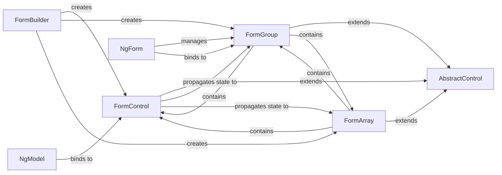

## Details

The FormControl subsystem in Angular is a core part of its forms module, enabling robust management of user input and validation. It adheres to the Web Framework patterns by providing clear model components, a builder for programmatic creation, and directives for template integration. The subsystem encompasses the core classes and directives responsible for defining, managing, and interacting with form inputs and their states within an Angular application. Its boundaries are primarily defined by the packages/forms/src/model/ directory and related directives.

### FormControl [[Expand]](./FormControl.md)
Manages the value, validation status, and state (dirty/pristine, touched/untouched, valid/invalid) of an individual form input. It is the most granular unit in the forms model.

**Related Classes/Methods**:

- <a href="https://github.com/angular/angular/blob/main/packages/forms/src/model/form_control.ts#L193-L359" target="_blank" rel="noopener noreferrer">`FormControl`:193-359</a>

### AbstractControl [[Expand]](./AbstractControl.md)
Serves as the base class for FormControl, FormGroup, and FormArray. It defines the common API and implements shared logic for managing value, validation, and control states (valid, invalid, dirty, pristine, touched, untouched, pending).

**Related Classes/Methods**:

- <a href="https://github.com/angular/angular/blob/main/packages/forms/src/model/abstract_model.ts#L468-L1767" target="_blank" rel="noopener noreferrer">`AbstractControl`:468-1767</a>

### FormGroup [[Expand]](./FormGroup.md)
Manages a collection of AbstractControl instances (typically FormControls) as a single unit. It aggregates their values and validation status, allowing for validation and state management of a group of related controls.

**Related Classes/Methods**:

- <a href="https://github.com/angular/angular/blob/main/packages/forms/src/directives/form_interface.ts" target="_blank" rel="noopener noreferrer">`FormGroup`</a>

### FormArray
Manages a dynamic, ordered collection of AbstractControl instances. This is particularly useful for forms where the number of input fields can change at runtime (e.g., a list of items).

**Related Classes/Methods**:

- <a href="https://github.com/angular/angular/blob/main/packages/forms/src/model/form_array.ts#L117-L547" target="_blank" rel="noopener noreferrer">`FormArray`:117-547</a>

### FormBuilder [[Expand]](./FormBuilder.md)
A service that provides a convenient, fluent API for creating instances of FormControl, FormGroup, and FormArray programmatically, simplifying the setup of complex form structures.

**Related Classes/Methods**:

- <a href="https://github.com/angular/angular/blob/main/packages/forms/src/form_builder.ts#L139-L407" target="_blank" rel="noopener noreferrer">`FormBuilder`:139-407</a>

### NgModel [[Expand]](./NgModel.md)
A directive used in template-driven forms to bind an HTML form element to a FormControl instance. It synchronizes data between the DOM and the model, enabling two-way data binding.

**Related Classes/Methods**:

- <a href="https://github.com/angular/angular/blob/main/packages/forms/src/directives/ng_model.ts#L161-L374" target="_blank" rel="noopener noreferrer">`NgModel`:161-374</a>

### NgForm
A directive that automatically creates a top-level FormGroup for a <form> element in template-driven forms. It manages form submission, reset, and overall form validation status.

**Related Classes/Methods**:

- <a href="https://github.com/angular/angular/blob/main/packages/forms/src/directives/ng_form.ts#L125-L382" target="_blank" rel="noopener noreferrer">`NgForm`:125-382</a>

### [FAQ](https://github.com/CodeBoarding/GeneratedOnBoardings/tree/main?tab=readme-ov-file#faq)