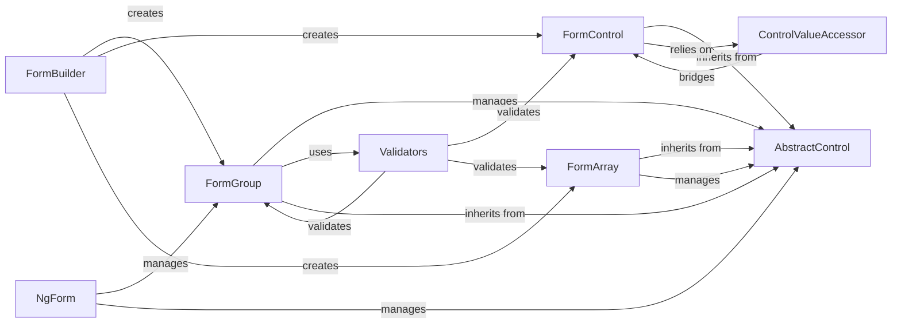

## Details

The Angular Forms subsystem is built around the `AbstractControl` base class, which provides the fundamental API and state management for all form elements. `FormControl`, `FormGroup`, and `FormArray` inherit from `AbstractControl`, representing individual controls, collections of controls, and ordered lists of controls, respectively. The `FormBuilder` service simplifies the creation of these control instances programmatically, promoting a reactive forms approach. For template-driven forms, the `NgForm` directive automatically creates and manages a top-level `FormGroup`. Validation logic is encapsulated within the `Validators` utility, which offers static methods to validate `AbstractControl` instances. Finally, the `ControlValueAccessor` interface acts as a crucial bridge, enabling `FormControl` instances to interact seamlessly with native DOM elements and custom components, synchronizing model values with the view. This architecture provides a flexible and powerful framework for building both simple and complex forms in Angular applications.

### FormGroup [[Expand]](./FormGroup.md)
Manages a collection of AbstractControl instances (e.g., FormControl, FormGroup, FormArray) as a single unit, aggregating their values and validation status. It acts as a container for related form fields, providing a unified interface for interaction.

**Related Classes/Methods**:

- <a href="https://github.com/angular/angular/blob/main/packages/forms/src/directives/form_interface.ts" target="_blank" rel="noopener noreferrer">`FormGroup`</a>

### AbstractControl [[Expand]](./AbstractControl.md)
The foundational abstract class for all form controls. It defines the core API and state management (value, status, validity, dirty, touched) for any form element, serving as the common interface for FormControl, FormGroup, and FormArray.

**Related Classes/Methods**:

- <a href="https://github.com/angular/angular/blob/main/packages/forms/src/model/abstract_model.ts#L468-L1767" target="_blank" rel="noopener noreferrer">`AbstractControl`:468-1767</a>

### FormControl [[Expand]](./FormControl.md)
Represents an individual form control, managing its own value, validation status, and user interaction states. It's the most granular unit of a form.

**Related Classes/Methods**:

- <a href="https://github.com/angular/angular/blob/main/packages/forms/src/model/form_control.ts#L193-L359" target="_blank" rel="noopener noreferrer">`FormControl`:193-359</a>

### FormArray
Manages an ordered, numerical collection of AbstractControl instances. This is particularly useful for dynamic forms where the number of controls can change at runtime (e.g., a list of items).

**Related Classes/Methods**:

- <a href="https://github.com/angular/angular/blob/main/packages/forms/src/model/form_array.ts#L117-L547" target="_blank" rel="noopener noreferrer">`FormArray`:117-547</a>

### FormBuilder [[Expand]](./FormBuilder.md)
A utility service that simplifies the programmatic creation of FormControl, FormGroup, and FormArray instances, reducing boilerplate code and improving readability for reactive forms.

**Related Classes/Methods**:

- <a href="https://github.com/angular/angular/blob/main/packages/forms/src/form_builder.ts#L139-L407" target="_blank" rel="noopener noreferrer">`FormBuilder`:139-407</a>

### NgForm
A directive used in template-driven forms. It automatically creates a top-level FormGroup for the <form> HTML element, tracking its submission state and managing child controls declared within the template.

**Related Classes/Methods**:

- <a href="https://github.com/angular/angular/blob/main/packages/forms/src/directives/ng_form.ts#L125-L382" target="_blank" rel="noopener noreferrer">`NgForm`:125-382</a>

### Validators
Provides static methods for common synchronous and asynchronous validation functions (e.g., required, minLength, email). These functions are applied to AbstractControl instances to determine their validity.

**Related Classes/Methods**:

- <a href="https://github.com/angular/angular/blob/main/.ng-dev/pull-request.mts#L21-L24" target="_blank" rel="noopener noreferrer">`Validators`:21-24</a>

### ControlValueAccessor
An interface defining how a FormControl interacts with a native DOM element or a custom component. It bridges the gap between the form model and the view, handling value synchronization and user input events.

**Related Classes/Methods**:

- <a href="https://github.com/angular/angular/blob/main/packages/forms/src/directives/control_value_accessor.ts#L141-L193" target="_blank" rel="noopener noreferrer">`ControlValueAccessor`:141-193</a>

### [FAQ](https://github.com/CodeBoarding/GeneratedOnBoardings/tree/main?tab=readme-ov-file#faq)