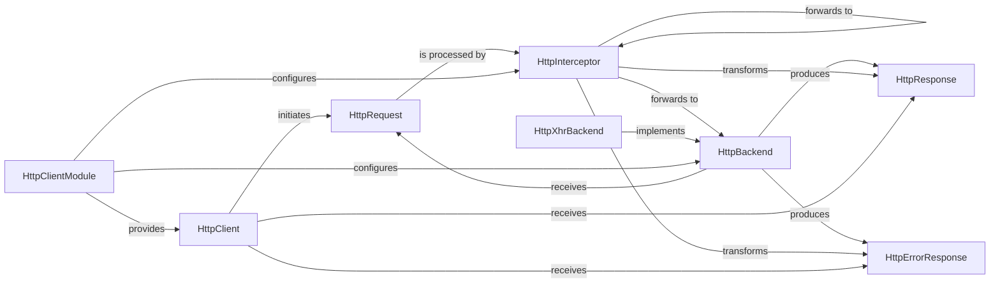

## Details

The subsystem under analysis encompasses the core components responsible for HTTP communication within an Angular application, including `HttpClient`, `HttpRequest`, `HttpResponse`, `HttpErrorResponse`, `HttpInterceptor`, `HttpBackend`, `HttpXhrBackend`, and `HttpClientModule`. The Angular HTTP subsystem provides a robust and extensible mechanism for handling web communication. At its core, the `HttpClient` serves as the primary interface for applications to initiate HTTP requests, encapsulating the details within an `HttpRequest` object. This request then enters a configurable pipeline of `HttpInterceptor`s, which can inspect, modify, or transform the request before it reaches the `HttpBackend`. The `HttpBackend`, typically implemented by `HttpXhrBackend` for browser environments, is responsible for the actual network transmission and receiving the raw `HttpResponse` or `HttpErrorResponse`. These responses then flow back through the same interceptor chain in reverse, allowing for further processing or transformation before being delivered to the `HttpClient`. The entire system is seamlessly integrated and configured via the `HttpClientModule`, which manages the provision of these services through Angular's dependency injection.

### HttpClient [[Expand]](./HttpClient.md)
The primary, high-level interface for making various HTTP requests (GET, POST, PUT, DELETE, etc.). It abstracts the underlying network communication and provides a fluent API for developers. It initiates the request lifecycle and handles the final response or error.

**Related Classes/Methods**: _None_

### HttpRequest
Represents an immutable outgoing HTTP request. It encapsulates all details of the request, including the HTTP method, URL, headers, and body. This object is passed through the interceptor chain.

**Related Classes/Methods**: _None_

### HttpResponse
Represents an immutable incoming HTTP response for successful requests. It contains the response status, headers, and the parsed response body.

**Related Classes/Methods**: _None_

### HttpErrorResponse
Represents an immutable incoming HTTP response specifically for error scenarios. It includes the error status, headers, and details about the error.

**Related Classes/Methods**: _None_

### HttpInterceptor
An interface that allows for intercepting and transforming HTTP requests and responses. Interceptors form a chain, enabling modular addition of cross-cutting concerns like authentication, logging, or caching without modifying the core `HttpClient` logic.

**Related Classes/Methods**: _None_

### HttpBackend
Defines the abstract interface for the actual execution of an HTTP request. It is the final handler in the interceptor chain, responsible for sending the request over the network and receiving the raw response.

**Related Classes/Methods**: _None_

### HttpXhrBackend
A concrete implementation of `HttpBackend` that utilizes the browser's native `XMLHttpRequest` object to perform HTTP requests.

**Related Classes/Methods**: _None_

### HttpClientModule
An Angular NgModule responsible for configuring and providing the `HttpClient` service and its related services (like interceptors and the `HttpBackend`) into the application's dependency injection system.

**Related Classes/Methods**: _None_

### [FAQ](https://github.com/CodeBoarding/GeneratedOnBoardings/tree/main?tab=readme-ov-file#faq)