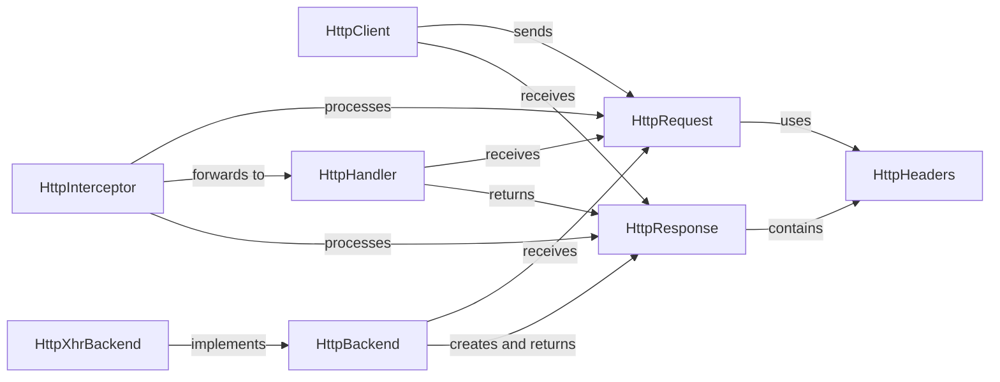

## Details

The Angular HTTP subsystem provides a robust and extensible mechanism for making HTTP requests. At its core, the HttpClient service initiates outgoing HttpRequest objects. These requests then flow through a chain of HttpInterceptors, which can inspect, modify, or even short-circuit the requests and their corresponding HttpResponse objects. Each HttpInterceptor delegates to the next HttpHandler in the chain. The final HttpHandler in this pipeline is typically an HttpBackend implementation, such as HttpXhrBackend, which dispatches the HttpRequest to the actual server and creates the HttpResponse. Upon receiving a response, it travels back through the interceptor chain to the HttpClient, allowing for further processing before being delivered to the application. Both HttpRequest and HttpResponse objects utilize HttpHeaders for managing request and response metadata.

### HttpClient [[Expand]](./HttpClient.md)
The primary service for initiating HTTP requests from the application. It serves as the entry point for all outgoing HTTP communication and receives HttpResponse objects.

**Related Classes/Methods**:

- <a href="https://github.com/angular/angular/blob/main/integration/platform-server/projects/ngmodule/src/app/http-transferstate-lazy-on-init/http-transferstate-lazy-on-init.component.ts" target="_blank" rel="noopener noreferrer">`HttpClient`</a>

### HttpHandler [[Expand]](./HttpHandler.md)
An interface defining the handle(request: HttpRequest): Observable<HttpEvent> method. It is the fundamental contract for any component participating in the HTTP request pipeline, enabling a chain of responsibility.

**Related Classes/Methods**:

- <a href="https://github.com/angular/angular/blob/main/packages/common/http/src/backend.ts#L148-L151" target="_blank" rel="noopener noreferrer">`HttpHandler`:148-151</a>

### HttpInterceptor
An interface for intercepting and transforming HTTP requests and responses. Interceptors can modify outgoing requests, handle responses, or even short-circuit the request by returning a synthetic response. It processes HttpRequest objects.

**Related Classes/Methods**:

- <a href="https://github.com/angular/angular/blob/main/packages/common/http/src/interceptor.ts#L53-L62" target="_blank" rel="noopener noreferrer">`HttpInterceptor`:53-62</a>

### HttpBackend
An abstract class implementing HttpHandler, serving as the terminal handler in the HTTP request pipeline. It is responsible for dispatching the request to the actual backend (e.g., using XMLHttpRequest or Fetch API) and creating HttpResponse objects.

**Related Classes/Methods**:

- <a href="https://github.com/angular/angular/blob/main/packages/upgrade/src/common/src/upgrade_helper.ts" target="_blank" rel="noopener noreferrer">`HttpBackend`</a>

### HttpXhrBackend
A concrete implementation of HttpBackend that uses the browser's XMLHttpRequest API to send HTTP requests. It's the default backend for most browser environments.

**Related Classes/Methods**:

- <a href="https://github.com/angular/angular/blob/main/packages/common/http/src/xhr.ts#L122-L451" target="_blank" rel="noopener noreferrer">`HttpXhrBackend`:122-451</a>

### HttpRequest
Represents an outgoing HTTP request, encapsulating the method, URL, headers, and body. It is an immutable object.

**Related Classes/Methods**:

- <a href="https://github.com/angular/angular/blob/main/packages/platform-server/src/types.d.ts" target="_blank" rel="noopener noreferrer">`HttpRequest`</a>

### HttpResponse
Represents an incoming HTTP response, containing the status, status text, headers, and response body. It is also an immutable object.

**Related Classes/Methods**:

- <a href="https://github.com/angular/angular/blob/main/packages/common/http/src/response.ts#L283-L343" target="_blank" rel="noopener noreferrer">`HttpResponse`:283-343</a>

### HttpHeaders
A utility class for managing HTTP headers, providing methods for setting, getting, and appending header values.

**Related Classes/Methods**:

- <a href="https://github.com/angular/angular/blob/main/packages/common/http/src/headers.ts#L22-L273" target="_blank" rel="noopener noreferrer">`HttpHeaders`:22-273</a>

### [FAQ](https://github.com/CodeBoarding/GeneratedOnBoardings/tree/main?tab=readme-ov-file#faq)