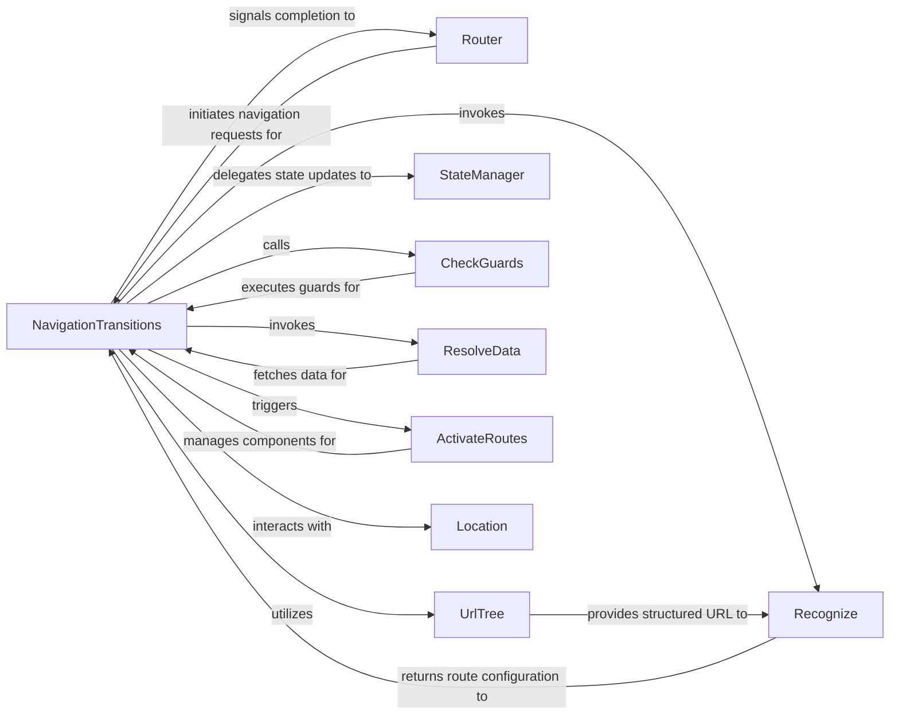

## Details

The Angular Router subsystem orchestrates the navigation within an application, managing the lifecycle from a URL change to component rendering. It follows a "Routing Flow" pattern, where `Router` initiates navigation, `NavigationTransitions` guides the process through various stages, including URL parsing by `UrlTree`, route matching by `Recognize`, guard execution by `CheckGuards`, data pre-fetching by `ResolveData`, and finally, component activation by `ActivateRoutes`. `StateManager` maintains the router's internal state, while `Location` provides an abstraction for browser interaction. This structured flow ensures consistent and controlled navigation, adapting to application logic and data requirements.

### NavigationTransitions [[Expand]](./NavigationTransitions.md)
The central orchestrator of the entire navigation lifecycle. It manages the detailed steps of a navigation request, including executing guard checks, resolving data, and loading/activating components. This aligns with the "Routing Flow" pattern, acting as the central control for the navigation pipeline.

**Related Classes/Methods**:

- <a href="https://github.com/angular/angular/blob/main/packages/router/src/router.ts" target="_blank" rel="noopener noreferrer">`NavigationTransitions`</a>

### Router [[Expand]](./Router.md)
Provides the public API for initiating and managing navigation within the application. It's the primary entry point for developers to interact with the routing system. This is a standard "Routing" pattern component.

**Related Classes/Methods**:

- <a href="https://github.com/angular/angular/blob/main/integration/nodenext_resolution/include-all.ts" target="_blank" rel="noopener noreferrer">`Router`</a>

### UrlTree [[Expand]](./UrlTree.md)
Represents the parsed and structured form of a URL. It handles the parsing, serialization, and comparison of URL segments, crucial for route matching and navigation. Essential for the "Routing Flow" to interpret and construct URLs.

**Related Classes/Methods**:

- <a href="https://github.com/angular/angular/blob/main/packages/router/src/router.ts#L457-L499" target="_blank" rel="noopener noreferrer">`UrlTree`:457-499</a>

### StateManager
Manages the router's internal state, including the current `UrlTree` and historical entries, ensuring consistency with the browser's URL. This is vital for maintaining the integrity of the "Routing Flow" and enabling features like back/forward navigation.

**Related Classes/Methods**:

- <a href="https://github.com/angular/angular/blob/main/packages/router/src/router.ts" target="_blank" rel="noopener noreferrer">`StateManager`</a>

### Recognize [[Expand]](./Recognize.md)
Matches a given `UrlTree` against the configured routes to determine the target `ActivatedRouteSnapshot` tree. This is a fundamental step in any "Routing Flow" to identify which components should be rendered.

**Related Classes/Methods**:

- <a href="https://github.com/angular/angular/blob/main/packages/router/src/operators/recognize.ts#L19-L42" target="_blank" rel="noopener noreferrer">`Recognize`:19-42</a>

### CheckGuards
Executes route guards (e.g., `CanActivate`, `CanDeactivate`, `CanLoad`) to control navigation flow based on authorization, data availability, or other conditions. This implements a critical aspect of "Routing Flow" for security and conditional navigation.

**Related Classes/Methods**:

- <a href="https://github.com/angular/angular/blob/main/packages/router/src/operators/check_guards.ts#L55-L83" target="_blank" rel="noopener noreferrer">`CheckGuards`:55-83</a>

### ResolveData
Handles asynchronous data fetching for routes, ensuring necessary data is available before component activation. This supports the "Data Flow" pattern within the "Routing Flow" by pre-loading data required by the activated components.

**Related Classes/Methods**:

- <a href="https://github.com/angular/angular/blob/main/packages/router/src/models.ts#L211-L213" target="_blank" rel="noopener noreferrer">`ResolveData`:211-213</a>

### ActivateRoutes
Manages the activation and deactivation of components and child routes, updating the UI based on the current router state. This directly supports the "Component-Based Architecture" by rendering the correct views as part of the "Routing Flow".

**Related Classes/Methods**:

- <a href="https://github.com/angular/angular/blob/main/packages/router/src/events.ts" target="_blank" rel="noopener noreferrer">`ActivateRoutes`</a>

### Location
Provides an abstraction for `NavigationTransitions` to interact with the browser's URL and history, allowing the router to update the address bar and respond to browser navigation events.

**Related Classes/Methods**:

- <a href="https://github.com/angular/angular/blob/main/packages/platform-server/src/http.ts" target="_blank" rel="noopener noreferrer">`Location`</a>

### [FAQ](https://github.com/CodeBoarding/GeneratedOnBoardings/tree/main?tab=readme-ov-file#faq)