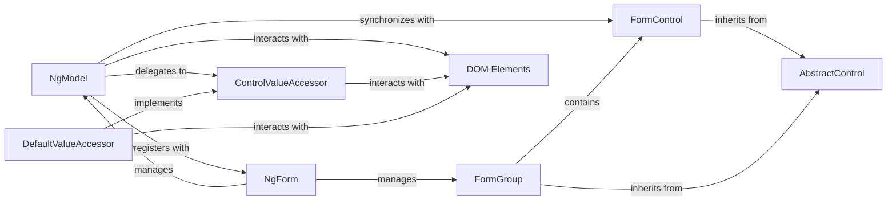

## Details

The Angular forms subsystem provides a robust framework for managing user input and validating data. At its core, `AbstractControl` serves as the foundational class for all form elements, including individual `FormControl` instances and collections like `FormGroup`. In template-driven forms, the `NgModel` directive acts as a crucial bridge, implicitly creating `FormControl` instances and facilitating two-way data binding between the application's data model and `DOM Elements`. This interaction with the DOM is abstracted through the `ControlValueAccessor` interface, with `DefaultValueAccessor` being a common implementation for standard HTML inputs. The `NgForm` directive orchestrates the entire template-driven form, managing the lifecycle and state of its contained `NgModel` and `FormGroup` components, and handling form-level events such as submission and reset. This layered architecture ensures a clear separation of concerns, enabling flexible and testable form implementations.

### NgModel [[Expand]](./NgModel.md)
A directive that creates an implicit FormControl instance for a DOM element and establishes two-way data binding between the element and the form model. It acts as the primary bridge for template-driven forms.

**Related Classes/Methods**:

- <a href="https://github.com/angular/angular/blob/main/packages/forms/src/directives/ng_model.ts#L161-L374" target="_blank" rel="noopener noreferrer">`@angular/forms.NgModel`:161-374</a>

### FormControl [[Expand]](./FormControl.md)
Represents an individual form control's state, including its value, validity, and user interaction status (touched/dirty). NgModel implicitly creates and manages an instance of this.

**Related Classes/Methods**:

- <a href="https://github.com/angular/angular/blob/main/packages/forms/src/model/form_control.ts#L57-L300" target="_blank" rel="noopener noreferrer">`@angular/forms.FormControl`:57-300</a>

### AbstractControl [[Expand]](./AbstractControl.md)
The base class for all form controls (FormControl, FormGroup, FormArray), providing common APIs for state management, validation, and value tracking.

**Related Classes/Methods**:

- <a href="https://github.com/angular/angular/blob/main/packages/forms/src/model/abstract_model.ts#L302-L1000" target="_blank" rel="noopener noreferrer">`@angular/forms.AbstractControl`:302-1000</a>

### ControlValueAccessor
An interface that allows Angular's FormControl (managed by NgModel) to interact with native DOM elements, abstracting away the specifics of different input types.

**Related Classes/Methods**:

- <a href="https://github.com/angular/angular/blob/main/packages/forms/src/directives/control_value_accessor.ts#L23-L132" target="_blank" rel="noopener noreferrer">`@angular/forms.ControlValueAccessor`:23-132</a>

### NgForm
A directive that represents the top-level form in template-driven forms. It aggregates and manages NgModel instances and FormGroup's, handling form submission and reset.

**Related Classes/Methods**:

- <a href="https://github.com/angular/angular/blob/main/packages/forms/src/directives/ng_form.ts#L133-L300" target="_blank" rel="noopener noreferrer">`@angular/forms.NgForm`:133-300</a>

### FormGroup [[Expand]](./FormGroup.md)
A collection of FormControl instances, used to group related controls and manage their collective value and validity as a single unit.

**Related Classes/Methods**:

- <a href="https://github.com/angular/angular/blob/main/packages/forms/src/model/form_group.ts#L184-L300" target="_blank" rel="noopener noreferrer">`@angular/forms.FormGroup`:184-300</a>

### DOM Elements
Represents native HTML DOM elements (e.g., <input>, <select>, <textarea>) that interact with Angular forms, serving as the visual and interactive part of the form. This is a conceptual component and does not have a direct source code reference within the Angular framework.

**Related Classes/Methods**: _None_

### DefaultValueAccessor
A concrete implementation of ControlValueAccessor specifically for standard text inputs and textareas, handling their value synchronization with the form model.

**Related Classes/Methods**:

- <a href="https://github.com/angular/angular/blob/main/packages/forms/src/directives/default_value_accessor.ts#L101-L141" target="_blank" rel="noopener noreferrer">`@angular/forms.DefaultValueAccessor`:101-141</a>

### [FAQ](https://github.com/CodeBoarding/GeneratedOnBoardings/tree/main?tab=readme-ov-file#faq)