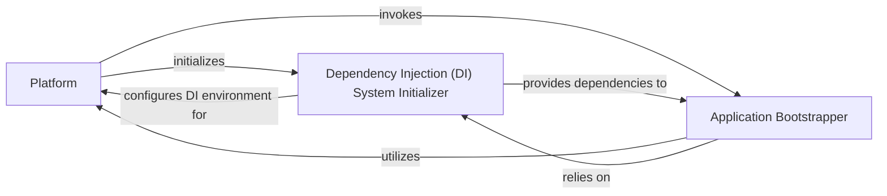

## Details

The Angular bootstrapping process is orchestrated by the `Platform` component, which sets up the core execution environment. The `Platform` then invokes the `Application Bootstrapper` (represented by `ApplicationRef`) to initiate the rendering and lifecycle of the main application module or standalone component. Crucially, the `Application Bootstrapper` relies on the `Dependency Injection (DI) System Initializer` (represented by `Injector`) to establish and configure the DI environment, ensuring that all necessary services and dependencies are correctly provided and resolved throughout the application's lifecycle. The `Dependency Injection (DI) System Initializer` configures the DI environment for the `Platform` and provides dependencies to the `Application Bootstrapper`, forming a cohesive system for application startup.

### Platform
This is the primary entry point and the central orchestrator of the bootstrapping process. It establishes the Angular execution environment, manages platform-specific configurations (e.g., browser, server), and provides the foundational services required for the application to run.

**Related Classes/Methods**:

- <a href="https://github.com/angular/angular/blob/main/packages/core/src/platform/platform.ts" target="_blank" rel="noopener noreferrer">`angular.core.platform.Platform`</a>

### Application Bootstrapper
This component represents the specific mechanism (e.g., `bootstrapModule` or `bootstrapApplication` function) that the `Platform` invokes to initiate the rendering and lifecycle of the root application module or standalone component. It takes the initialized platform and the application's entry point to start the rendering process.

**Related Classes/Methods**:

### Dependency Injection (DI) System Initializer
This conceptual component represents the part of the bootstrapping process responsible for setting up and configuring Angular's powerful dependency injection system. It ensures that the `Injector` hierarchy is established and that services and other dependencies are correctly provided and resolved throughout the application's lifecycle.

**Related Classes/Methods**:

### [FAQ](https://github.com/CodeBoarding/GeneratedOnBoardings/tree/main?tab=readme-ov-file#faq)