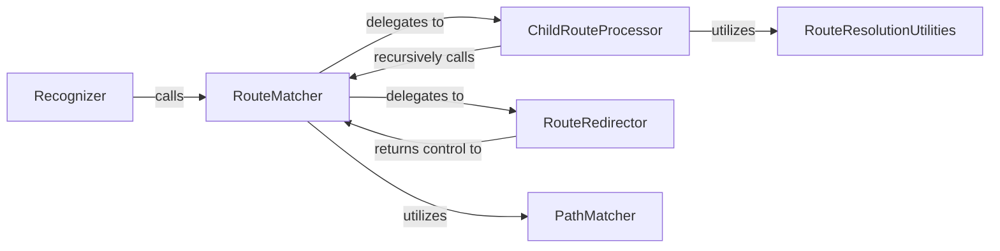

## Details

The Angular Router's recognition subsystem, orchestrated by the `Recognizer`, is responsible for transforming a `UrlTree` into an `ActivatedRouteSnapshot` hierarchy. The `RouteMatcher` component, central to this process, recursively traverses the URL segments and route configurations, delegating to specialized components for specific matching and processing tasks. The `ChildRouteProcessor` handles the recursive matching and integration of child routes, ensuring proper handling of nested configurations and outlet names. During this process, the `RouteRedirector` manages any route redirections, while the `PathMatcher` performs the atomic comparison of URL segments against defined route paths. Finally, `RouteResolutionUtilities` assist in consolidating and validating the resolved route hierarchy, particularly for empty path matches and outlet uniqueness. This collaborative structure ensures a robust and accurate route recognition process.

### Recognizer
The top-level orchestrator and entry point for the entire route recognition process. It initiates the matching of a `UrlTree` against the application's configured route definitions.

**Related Classes/Methods**:

- <a href="https://github.com/angular/angular/blob/main/packages/router/src/recognize.ts#L78-L532" target="_blank" rel="noopener noreferrer">`Recognizer`:78-532</a>

### RouteMatcher
Encapsulates the core recursive algorithm for traversing the route tree. It systematically matches URL segments and groups (`UrlSegmentGroup`) against route configurations, driving the depth-first search through the defined routes. This component combines the responsibilities of the `match`, `processSegmentGroup`, and `processSegment` methods within the `Recognizer` class.

**Related Classes/Methods**:

- <a href="https://github.com/angular/angular/blob/main/adev/shared-docs/pipeline/guides/state.mts" target="_blank" rel="noopener noreferrer">`match`</a>
- <a href="https://github.com/angular/angular/blob/main/packages/router/src/recognize.ts#L168-L188" target="_blank" rel="noopener noreferrer">`processSegmentGroup`:168-188</a>
- <a href="https://github.com/angular/angular/blob/main/packages/router/src/recognize.ts#L246-L286" target="_blank" rel="noopener noreferrer">`processSegment`:246-286</a>

### ChildRouteProcessor
Manages the recursive processing and integration of child route configurations. It ensures that nested routes are correctly matched and integrated into the activated route hierarchy, handling aspects like outlet names and empty path routes. This component corresponds to the `processChildren` method within the `Recognizer` class.

**Related Classes/Methods**:

- <a href="https://github.com/angular/angular/blob/main/packages/router/src/create_url_tree.ts" target="_blank" rel="noopener noreferrer">`processChildren`</a>

### RouteRedirector
Handles the application of redirect logic for routes that have a `redirectTo` property. It validates the redirect target and ensures the routing process continues correctly after a redirection. This component corresponds to the `expandSegmentAgainstRouteUsingRedirect` function, which is used by the `ApplyRedirects` class.

**Related Classes/Methods**:

- <a href="https://github.com/angular/angular/blob/main/packages/router/src/recognize.ts#L342-L407" target="_blank" rel="noopener noreferrer">`expandSegmentAgainstRouteUsingRedirect`:342-407</a>

### PathMatcher
Performs the direct comparison of a URL segment against a route's defined path. This includes handling path parameters and wildcards, serving as the atomic unit for segment-to-path matching. This component corresponds to the `matchSegmentAgainstRoute` function.

**Related Classes/Methods**:

- <a href="https://github.com/angular/angular/blob/main/packages/router/src/recognize.ts#L409-L498" target="_blank" rel="noopener noreferrer">`matchSegmentAgainstRoute`:409-498</a>

### RouteResolutionUtilities
Provides utility functions crucial for resolving the final activated route hierarchy. This includes correctly handling and merging routes with an empty path and ensuring that outlet names within the same level of the route hierarchy are unique to prevent conflicts. This component combines the responsibilities of the `mergeEmptyPathMatches` and `checkOutletNameUniqueness` functions.

**Related Classes/Methods**:

- <a href="https://github.com/angular/angular/blob/main/packages/router/src/recognize.ts#L552-L584" target="_blank" rel="noopener noreferrer">`mergeEmptyPathMatches`:552-584</a>
- <a href="https://github.com/angular/angular/blob/main/packages/router/src/recognize.ts#L586-L601" target="_blank" rel="noopener noreferrer">`checkOutletNameUniqueness`:586-601</a>

### [FAQ](https://github.com/CodeBoarding/GeneratedOnBoardings/tree/main?tab=readme-ov-file#faq)