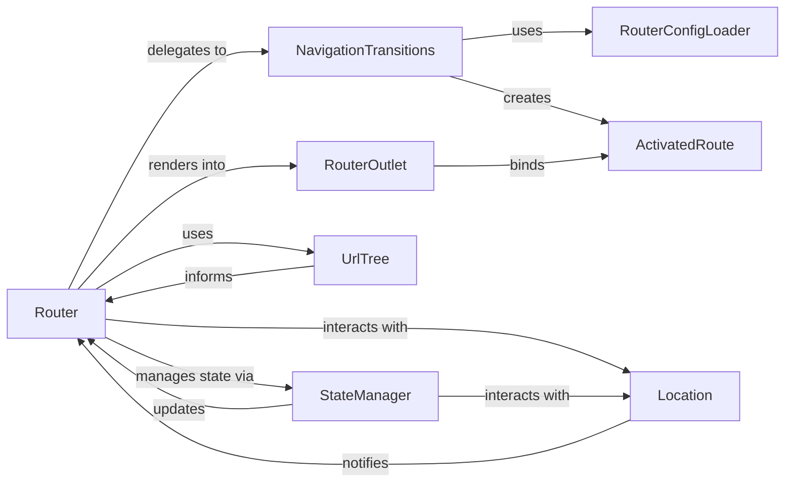

## Details

The Angular Router subsystem is a sophisticated mechanism for managing application navigation. At its core, the `Router` orchestrates the entire routing process, acting as the central programmatic interface for navigation. It delegates the complex steps of a navigation request, including route recognition and component activation, to `NavigationTransitions`. The `StateManager` is crucial for maintaining the router's internal state and processing events, interacting closely with the `Location` service, which abstracts browser URL and history interactions. `UrlTree` provides a structured representation of the URL, enabling programmatic manipulation and informing the `Router`. For rendering, the `Router` utilizes `RouterOutlet` directives as placeholders in templates, which in turn bind to `ActivatedRoute` instances to provide components with route-specific information. Finally, `RouterConfigLoader` supports asynchronous loading and validation of route configurations, particularly for lazy-loaded modules, ensuring efficient and dynamic routing.

### Router [[Expand]](./Router.md)
The primary orchestrator of the routing process. It initiates and manages the entire navigation lifecycle, serving as the main programmatic interface for navigation. It listens for URL changes, matches routes, and orchestrates the activation of components.

**Related Classes/Methods**:

- <a href="https://github.com/angular/angular/blob/main/integration/nodenext_resolution/include-all.ts" target="_blank" rel="noopener noreferrer">`Router`</a>

### NavigationTransitions [[Expand]](./NavigationTransitions.md)
Executes the complex steps of a navigation request. This includes route recognition, guard execution, data resolution, and component activation.

**Related Classes/Methods**:

- <a href="https://github.com/angular/angular/blob/main/packages/router/src/router.ts" target="_blank" rel="noopener noreferrer">`NavigationTransitions`</a>

### StateManager
Manages the router's internal state (current URL tree, activated routes) and processes router events. It also interacts with the browser's history.

**Related Classes/Methods**:

- <a href="https://github.com/angular/angular/blob/main/packages/router/src/router.ts" target="_blank" rel="noopener noreferrer">`StateManager`</a>

### UrlTree [[Expand]](./UrlTree.md)
Represents and manipulates the parsed URL structure, enabling programmatic navigation and URL manipulation.

**Related Classes/Methods**:

- <a href="https://github.com/angular/angular/blob/main/packages/router/src/router.ts#L457-L499" target="_blank" rel="noopener noreferrer">`UrlTree`:457-499</a>

### ActivatedRoute
Provides a snapshot of the current route's information (parameters, data, URL segments) to components.

**Related Classes/Methods**:

- <a href="https://github.com/angular/angular/blob/main/packages/router/src/create_router_state.ts#L73-L84" target="_blank" rel="noopener noreferrer">`ActivatedRoute`:73-84</a>

### RouterOutlet [[Expand]](./RouterOutlet.md)
A directive that acts as a placeholder in the template where the `Router` renders components for activated routes.

**Related Classes/Methods**:

- <a href="https://github.com/angular/angular/blob/main/packages/router/src/directives/router_outlet.ts#L205-L409" target="_blank" rel="noopener noreferrer">`RouterOutlet`:205-409</a>

### Location
Provides an abstraction over the browser's URL and history API, allowing the router to interact with the browser without direct DOM manipulation.

**Related Classes/Methods**:

- <a href="https://github.com/angular/angular/blob/main/packages/platform-server/src/http.ts" target="_blank" rel="noopener noreferrer">`Location`</a>

### RouterConfigLoader
Asynchronously loads and validates route configurations, especially for lazy-loaded modules/components.

**Related Classes/Methods**:

- <a href="https://github.com/angular/angular/blob/main/packages/router/src/router_config_loader.ts#L43-L115" target="_blank" rel="noopener noreferrer">`RouterConfigLoader`:43-115</a>

### [FAQ](https://github.com/CodeBoarding/GeneratedOnBoardings/tree/main?tab=readme-ov-file#faq)