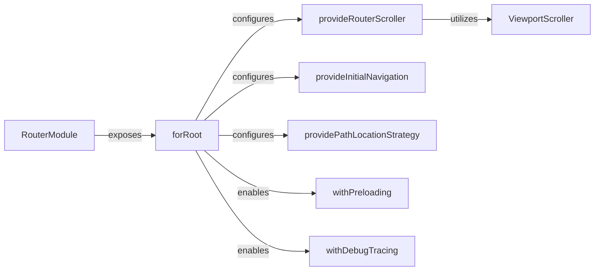

## Details

The `RouterModule` subsystem in Angular encompasses the core functionalities for declarative routing within an application. Its boundaries are defined by the `RouterModule` itself, which acts as the entry point, and the various configuration functions and services it exposes or utilizes to manage navigation, URL strategies, and router-related behaviors. This subsystem is primarily concerned with mapping URLs to components, managing navigation states, and providing hooks for controlling the routing process.

### RouterModule [[Expand]](./RouterModule.md)
The primary Angular module that encapsulates and exports all router-related providers and directives. It serves as the entry point for integrating the router into an Angular application.

**Related Classes/Methods**:

- <a href="https://github.com/angular/angular/blob/main/packages/router/src/router_module.ts#L108-L195" target="_blank" rel="noopener noreferrer">`RouterModule`:108-195</a>

### forRoot
A static method of `RouterModule` crucial for configuring the root application module with routing. It sets up the global router instance and applies initial configurations.

**Related Classes/Methods**:

- <a href="https://github.com/angular/angular/blob/main/packages/router/src/router_module.ts" target="_blank" rel="noopener noreferrer">`RouterModule:forRoot`</a>

### provideRouterScroller
A function that configures the router's scroll restoration behavior, allowing control over how the scroll position is managed during navigation.

**Related Classes/Methods**:

- <a href="https://github.com/angular/angular/blob/main/packages/router/src/router_module.ts#L201-L216" target="_blank" rel="noopener noreferrer">`provideRouterScroller`:201-216</a>

### provideInitialNavigation
Defines the strategy for how the router handles the very first navigation event when the application loads.

**Related Classes/Methods**:

- <a href="https://github.com/angular/angular/blob/main/packages/router/src/router_module.ts#L243-L250" target="_blank" rel="noopener noreferrer">`provideInitialNavigation`:243-250</a>

### providePathLocationStrategy
Configures the router to use the default HTML5 pushState-based URL strategy, which uses clean paths without hashes. (Note: `provideHashLocationStrategy` is an alternative for hash-based URLs).

**Related Classes/Methods**:

- <a href="https://github.com/angular/angular/blob/main/packages/router/src/router_module.ts#L226-L228" target="_blank" rel="noopener noreferrer">`providePathLocationStrategy`:226-228</a>

### withPreloading
An optional configuration function that enables preloading of lazy-loaded modules in the background, improving the user experience by making subsequent navigations faster.

**Related Classes/Methods**:

- <a href="https://github.com/angular/angular/blob/main/packages/router/src/provide_router.ts#L535-L541" target="_blank" rel="noopener noreferrer">`withPreloading`:535-541</a>

### withDebugTracing
An optional configuration function that enables detailed logging of router events, invaluable for debugging complex navigation flows.

**Related Classes/Methods**:

- <a href="https://github.com/angular/angular/blob/main/packages/router/src/provide_router.ts#L467-L492" target="_blank" rel="noopener noreferrer">`withDebugTracing`:467-492</a>

### ViewportScroller
A service from `@angular/common` that provides an API for managing the scroll position of the viewport.

**Related Classes/Methods**:

- <a href="https://github.com/angular/angular/blob/main/packages/router/src/router_scroller.ts" target="_blank" rel="noopener noreferrer">`ViewportScroller`</a>

### [FAQ](https://github.com/CodeBoarding/GeneratedOnBoardings/tree/main?tab=readme-ov-file#faq)