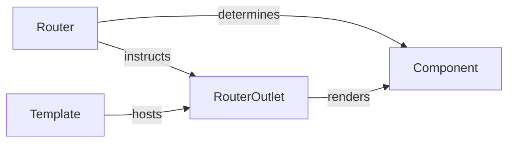

## Details

This subsystem focuses on the client-side routing mechanism within an Angular application. The Router service interprets URL changes and determines which Component should be displayed. The RouterOutlet acts as a dynamic placeholder within a Template, where the Component selected by the Router is rendered. This interaction ensures a seamless single-page application experience by dynamically updating the view without full page reloads.

### RouterOutlet [[Expand]](./RouterOutlet.md)
A structural directive that serves as a placeholder in a component's template. It dynamically renders the Component associated with the active route, managing its lifecycle.

**Related Classes/Methods**: _None_

### Router [[Expand]](./Router.md)
The primary service responsible for interpreting URL changes, matching them against defined routes, and instructing the RouterOutlet on which Component to render.

**Related Classes/Methods**: _None_

### Component
The fundamental building block of an Angular application's user interface. These are the UI elements that the RouterOutlet renders based on the active route.

**Related Classes/Methods**: _None_

### Template
The HTML structure where the RouterOutlet directive is placed. It defines the specific location within the UI where routed Components will be rendered.

**Related Classes/Methods**: _None_

### [FAQ](https://github.com/CodeBoarding/GeneratedOnBoardings/tree/main?tab=readme-ov-file#faq)