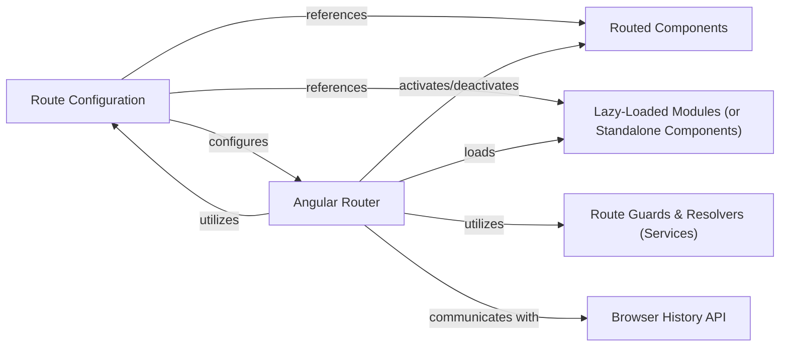

## Details

The Angular Router subsystem is central to the application's navigation. It is initialized by the `routerProviders` in `src/app/app.config.ts`, which sets up the core `Angular Router` using the `routes` defined in `src/app/routes.ts`. This `Route Configuration` dictates which `Routed Components` or `Lazy-Loaded Modules` are loaded and displayed based on the URL. During navigation, `Route Guards & Resolvers` can intercept or augment the process, for instance, by pre-fetching data or controlling access. The `Angular Router` seamlessly integrates with the `Browser History API` to manage the browser's URL and history, providing a consistent and expected user experience for navigation within the single-page application.

### Route Configuration
This component serves as the central definition point for all application routes, mapping specific URLs to corresponding UI components or lazy-loaded modules. It acts as the blueprint for the application's navigation structure.

**Related Classes/Methods**:

### Angular Router
The core service provided by Angular that interprets the Route Configuration, manages navigation events, activates and deactivates components, and handles URL changes in the browser. It is the engine that drives the application's navigation.

**Related Classes/Methods**:

### Routed Components
These are the specific UI components of the application that are rendered and displayed in the view based on the currently active route. They represent the distinct pages or sections of the application.

**Related Classes/Methods**:

### Lazy-Loaded Modules (or Standalone Components)
These are application modules or standalone components that are loaded asynchronously and on-demand only when a particular route is activated. This mechanism helps optimize the initial load time of the application.

**Related Classes/Methods**:

### Route Guards & Resolvers (Services)
These are application services that implement specific logic to control navigation (guards, e.g., for authentication/authorization) or to pre-fetch necessary data before a route is activated (resolvers).

**Related Classes/Methods**:

### Browser History API
The underlying browser API that the Angular Router interacts with to manipulate the browser's history stack, enabling features like URL changes, and the browser's back and forward navigation buttons.

**Related Classes/Methods**:

### [FAQ](https://github.com/CodeBoarding/GeneratedOnBoardings/tree/main?tab=readme-ov-file#faq)