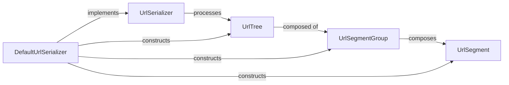

## Details

The Angular Router's URL parsing and serialization subsystem is centered around the `UrlTree` data structure, which immutably represents the parsed state of a URL. This `UrlTree` is a hierarchical composition of `UrlSegmentGroup`s, which in turn contain `UrlSegment`s, providing a granular representation of the URL path and its parameters. The `UrlSerializer` interface defines the contract for converting between URL strings and `UrlTree` objects, with `DefaultUrlSerializer` providing the standard implementation. This design allows for flexible and extensible URL handling, enabling the router to accurately interpret and construct URLs for navigation and state management. The `DefaultUrlSerializer` acts as the primary orchestrator for constructing the `UrlTree` components from a raw URL string and vice-versa.

### UrlTree [[Expand]](./UrlTree.md)
The central immutable data structure representing a parsed URL. It acts as the "Model" for the URL state, holding the hierarchical structure of URL segments, query parameters, and the fragment. This is fundamental for the router to understand and navigate the application state.

**Related Classes/Methods**:

- <a href="https://github.com/angular/angular/blob/main/packages/router/src/router.ts" target="_blank" rel="noopener noreferrer">`UrlSegmentGroup`</a>
- <a href="https://github.com/angular/angular/blob/main/packages/router/src/router_scroller.ts" target="_blank" rel="noopener noreferrer">`UrlSerializer`</a>

### UrlSegmentGroup
Represents a hierarchical group of `UrlSegment`s. It allows for the representation of nested routing structures, where a parent segment group can have multiple child segment groups (e.g., for auxiliary routes). This component is crucial for modeling complex URL paths.

**Related Classes/Methods**:

- <a href="https://github.com/angular/angular/blob/main/packages/router/src/url_tree.ts#L307-L328" target="_blank" rel="noopener noreferrer">`UrlSegment`:307-328</a>
- <a href="https://github.com/angular/angular/blob/main/packages/router/src/router.ts#L457-L499" target="_blank" rel="noopener noreferrer">`UrlTree`:457-499</a>

### UrlSegment
Represents a single path segment of a URL, including its associated matrix parameters. This is the atomic unit of a URL path, providing granular detail for routing decisions.

**Related Classes/Methods**:

- <a href="https://github.com/angular/angular/blob/main/packages/router/src/router.ts" target="_blank" rel="noopener noreferrer">`UrlSegmentGroup`</a>
- <a href="https://github.com/angular/angular/blob/main/packages/router/src/url_tree.ts#L396-L412" target="_blank" rel="noopener noreferrer">`DefaultUrlSerializer`:396-412</a>

### UrlSerializer
An abstract interface that defines the contract for converting a `UrlTree` into a URL string and vice-versa. It provides an extensible mechanism for custom URL serialization/deserialization logic, allowing developers to define their own URL formats.

**Related Classes/Methods**:

- <a href="https://github.com/angular/angular/blob/main/packages/router/src/router.ts#L457-L499" target="_blank" rel="noopener noreferrer">`UrlTree`:457-499</a>
- <a href="https://github.com/angular/angular/blob/main/packages/router/src/url_tree.ts#L396-L412" target="_blank" rel="noopener noreferrer">`DefaultUrlSerializer`:396-412</a>

### DefaultUrlSerializer
The default implementation of the `UrlSerializer` interface. It handles the standard URL parsing and serialization rules, including encoding/decoding of URL components, ensuring compliance with web standards.

**Related Classes/Methods**:

- <a href="https://github.com/angular/angular/blob/main/packages/router/src/router_scroller.ts" target="_blank" rel="noopener noreferrer">`UrlSerializer`</a>
- <a href="https://github.com/angular/angular/blob/main/packages/router/src/router.ts#L457-L499" target="_blank" rel="noopener noreferrer">`UrlTree`:457-499</a>
- <a href="https://github.com/angular/angular/blob/main/packages/router/src/router.ts" target="_blank" rel="noopener noreferrer">`UrlSegmentGroup`</a>
- <a href="https://github.com/angular/angular/blob/main/packages/router/src/url_tree.ts#L307-L328" target="_blank" rel="noopener noreferrer">`UrlSegment`:307-328</a>

### [FAQ](https://github.com/CodeBoarding/GeneratedOnBoardings/tree/main?tab=readme-ov-file#faq)