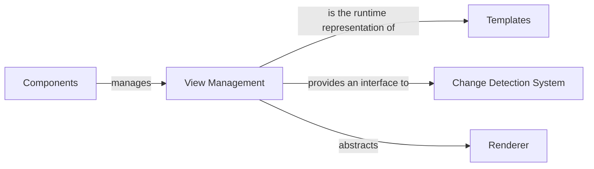

## Details

The Angular rendering subsystem is centered around the `View Management` component, embodied by `ViewRef`, which serves as the runtime representation of an Angular view. `Components` (represented by `ComponentRef`) are the high-level building blocks that manage and create instances of `View Management`. `Templates` provide the declarative structure for these views, which `View Management` instances then embody. The `Change Detection System` (`ChangeDetectorRef`) interacts with `View Management` to update the UI based on data changes. Finally, `View Management` abstracts the `Renderer` (`Renderer2`), which handles platform-specific rendering operations, ensuring a consistent API across different environments. This architecture promotes a clear separation of concerns, allowing for efficient rendering and change propagation within Angular applications.

### View Management [[Expand]](./View_Management.md)
Represents an Angular view at runtime, providing an API to interact with its lifecycle (e.g., creation, destruction) and to trigger or participate in change detection cycles. It acts as the central orchestrator for view-related operations.

**Related Classes/Methods**:

- <a href="https://github.com/angular/angular/blob/main/packages/core/src/render3/view_ref.ts" target="_blank" rel="noopener noreferrer">`angular.core.render3.ViewRef`</a>

### Components
High-level Angular building blocks that encapsulate application logic and define the structure of a part of the UI. Components are responsible for creating and managing instances of View Management.

**Related Classes/Methods**:

- <a href="https://github.com/angular/angular/blob/main/packages/core/src/application/application_ref.ts" target="_blank" rel="noopener noreferrer">`angular.core.ComponentRef`</a>

### Templates
Declarative blueprints (often HTML with Angular-specific syntax) that define the static structure and data bindings of an Angular view. They are compiled into a runtime representation that View Management instances embody.

**Related Classes/Methods**:

### Change Detection System
The mechanism responsible for detecting changes in application data and propagating these changes to update the corresponding parts of the UI. View Management provides an interface for this system to interact with the view.

**Related Classes/Methods**:

- <a href="https://github.com/angular/angular/blob/main/packages/core/src/change_detection/change_detector_ref.ts" target="_blank" rel="noopener noreferrer">`angular.core.ChangeDetectorRef`</a>

### Renderer
A low-level abstraction layer that handles platform-specific rendering operations, such as direct DOM manipulation in a browser environment. View Management abstracts the Renderer to provide a consistent view API regardless of the underlying rendering platform.

**Related Classes/Methods**:

- <a href="https://github.com/angular/angular/blob/main/packages/core/src/render3/interfaces/renderer.ts" target="_blank" rel="noopener noreferrer">`angular.core.Renderer2`</a>

### [FAQ](https://github.com/CodeBoarding/GeneratedOnBoardings/tree/main?tab=readme-ov-file#faq)