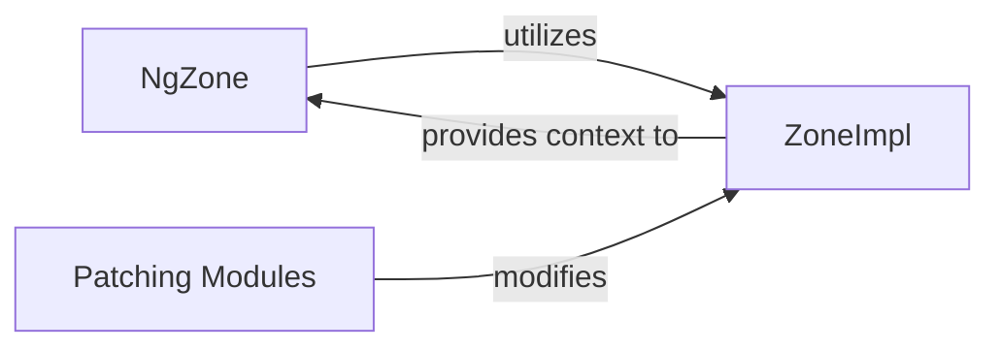

## Details

The core interaction revolves around NgZone leveraging ZoneImpl to manage asynchronous operations and trigger Angular's change detection. ZoneImpl acts as the central runtime, intercepting asynchronous tasks through the modifications applied by Patching Modules. These modules are crucial as they instrument the native APIs, allowing ZoneImpl to track and propagate execution contexts across asynchronous boundaries. NgZone then uses this contextual information from ZoneImpl to determine when to run Angular's change detection cycle, ensuring the UI remains synchronized with the application state.

The Angular application's responsiveness and efficient change detection are largely facilitated by the integration of NgZone with Zone.js. At the heart of this integration is ZoneImpl, the runtime that intercepts and tracks asynchronous operations across the application. This interception is made possible by various Patching Modules that instrument native browser and Node.js APIs, ensuring that all asynchronous tasks are wrapped within a Zone. NgZone then acts as the bridge, leveraging ZoneImpl's capabilities to be notified of asynchronous task completions, thereby intelligently triggering Angular's change detection cycle and maintaining a synchronized application state.

### NgZone
Angular's primary interface to Zone.js. It provides a controlled environment for executing code within or outside Angular's change detection zone, notifying Angular when asynchronous operations complete to trigger change detection.

**Related Classes/Methods**:

- <a href="https://github.com/angular/angular/blob/main/integration/ng_elements/src/main.ts" target="_blank" rel="noopener noreferrer">`NgZone`</a>

### ZoneImpl
The foundational runtime of Zone.js. It intercepts and tracks asynchronous operations across various JavaScript APIs (e.g., setTimeout, Promise, DOM events), propagating execution context across asynchronous boundaries.

**Related Classes/Methods**:

- <a href="https://github.com/angular/angular/blob/main/packages/zone.js/lib/zone-impl.ts#L784-L1095" target="_blank" rel="noopener noreferrer">`ZoneImpl`:784-1095</a>

### Patching Modules
A collection of modules within Zone.js that modify (patch) native browser and Node.js APIs (like setTimeout, Promise, XMLHttpRequest) to integrate them with the Zone.js tracking mechanism, ensuring that asynchronous operations are properly captured and managed by ZoneImpl.

**Related Classes/Methods**:

- <a href="https://github.com/angular/angular/blob/main/packages/zone.js/lib/common/promise.ts" target="_blank" rel="noopener noreferrer">`PromisePatching`</a>
- <a href="https://github.com/angular/angular/blob/main/packages/zone.js/lib/common/timers.ts" target="_blank" rel="noopener noreferrer">`TimersPatching`</a>
- <a href="https://github.com/angular/angular/blob/main/packages/zone.js/lib/browser/browser.ts" target="_blank" rel="noopener noreferrer">`BrowserPatching`</a>
- <a href="https://github.com/angular/angular/blob/main/packages/zone.js/lib/node/node.ts" target="_blank" rel="noopener noreferrer">`NodePatching`</a>

### [FAQ](https://github.com/CodeBoarding/GeneratedOnBoardings/tree/main?tab=readme-ov-file#faq)