```mermaid
graph LR
    Angular_Build_Compile_System["Angular Build & Compile System"]
    Angular_Core_Runtime["Angular Core Runtime"]
    Angular_Forms_Module["Angular Forms Module"]
    Angular_Router_Module["Angular Router Module"]
    Angular_HTTP_Client_Service_Worker_Module["Angular HTTP Client & Service Worker Module"]
    External_Backend_Services["External Backend Services"]
    Angular_Build_Compile_System -- "Configures & Compiles" --> Angular_Core_Runtime
    Angular_Build_Compile_System -- "Processes & Optimizes" --> Angular_Forms_Module
    Angular_Build_Compile_System -- "Processes & Optimizes" --> Angular_Router_Module
    Angular_Core_Runtime -- "Manages & Updates" --> Angular_Forms_Module
    Angular_Forms_Module -- "Submits Data To" --> Angular_Core_Runtime
    Angular_Core_Runtime -- "Manages & Integrates" --> Angular_Router_Module
    Angular_Router_Module -- "Directs View Rendering For" --> Angular_Core_Runtime
    Angular_Core_Runtime -- "Initializes & Manages" --> Angular_HTTP_Client_Service_Worker_Module
    Angular_HTTP_Client_Service_Worker_Module -- "Manages Requests To" --> External_Backend_Services
    External_Backend_Services -- "Provides Data To" --> Angular_HTTP_Client_Service_Worker_Module
    click Angular_Build_Compile_System href "https://github.com/CodeBoarding/GeneratedOnBoardings/blob/main/angular/Angular_Build_Compile_System.md" "Details"
    click Angular_Core_Runtime href "https://github.com/CodeBoarding/GeneratedOnBoardings/blob/main/angular/Angular_Core_Runtime.md" "Details"
    click Angular_Forms_Module href "https://github.com/CodeBoarding/GeneratedOnBoardings/blob/main/angular/Angular_Forms_Module.md" "Details"
    click Angular_Router_Module href "https://github.com/CodeBoarding/GeneratedOnBoardings/blob/main/angular/Angular_Router_Module.md" "Details"
    click Angular_HTTP_Client_Service_Worker_Module href "https://github.com/CodeBoarding/GeneratedOnBoardings/blob/main/angular/Angular_HTTP_Client_Service_Worker_Module.md" "Details"
    click External_Backend_Services href "https://github.com/CodeBoarding/GeneratedOnBoardings/blob/main/angular/External_Backend_Services.md" "Details"
```

## Details

The Angular architecture is structured around a core runtime that orchestrates various modules to build dynamic web applications. The Angular Build & Compile System acts as the initial entry point, transforming source code into an optimized runtime bundle. This bundle, primarily driven by the Angular Core Runtime, then manages the application's lifecycle, including dependency injection, change detection, and direct DOM manipulation. Specialized modules like the Angular Forms Module and Angular Router Module extend the core's capabilities. The Forms Module handles user input, submitting data back to the Core Runtime for processing. The Router Module manages in-application navigation, directing the Core Runtime on which views to render based on routes. For external data interactions, the Angular HTTP Client & Service Worker Module manages requests to External Backend Services and processes their responses, optionally leveraging service workers for caching and offline support. These interactions form the backbone of an Angular application, enabling a clear separation of concerns and a modular approach to development.

### Angular Build & Compile System [[Expand]](./Angular_Build_Compile_System.md)
Orchestrates the entire development workflow, from project creation and serving to compilation and deployment. It transforms Angular source code (templates, decorators) into optimized JavaScript (Ivy instructions) that the browser can execute. This includes processing internationalization assets.

**Related Classes/Methods**:

- <a href="https://github.com/angular/angular/blob/main/packages/compiler-cli/src/main.ts" target="_blank" rel="noopener noreferrer">`packages/compiler-cli/src/main.ts`</a>
- <a href="https://github.com/angular/angular/blob/main/packages/compiler-cli/src/ngtsc/core/src/compiler.ts" target="_blank" rel="noopener noreferrer">`packages.compiler-cli.src.ngtsc.core.src.compiler.ts`</a>
- <a href="https://github.com/angular/angular/blob/main/packages/compiler/src/render3/view/compiler.ts" target="_blank" rel="noopener noreferrer">`packages/compiler/src/render3/view/compiler.ts`</a>
- <a href="https://github.com/angular/angular/blob/main/packages/localize/src/translate.ts" target="_blank" rel="noopener noreferrer">`packages/localize/src/translate.ts`</a>
- <a href="https://github.com/angular/angular/blob/main/packages/common/locales/generate-locales-tool/locale-file.ts" target="_blank" rel="noopener noreferrer">`packages/common/locales/generate-locales-tool/locale-file.ts`</a>

### Angular Core Runtime [[Expand]](./Angular_Core_Runtime.md)
The foundational part of Angular that initializes the application, manages the root component, orchestrates the overall application lifecycle, handles dependency injection, detects changes in application data, and directly manipulates the DOM. It also includes the modern reactivity model (Signals) and integrates with Zone.js for asynchronous context. Animations and the Upgrade module also interact closely with this core.

**Related Classes/Methods**:

- <a href="https://github.com/angular/angular/blob/main/packages/core/src/platform/platform_ref.ts" target="_blank" rel="noopener noreferrer">`packages/core/src/platform/platform_ref.ts`</a>
- <a href="https://github.com/angular/angular/blob/main/packages/core/src/di/r3_injector.ts" target="_blank" rel="noopener noreferrer">`packages/core/src/di/r3_injector.ts`</a>
- <a href="https://github.com/angular/angular/blob/main/packages/core/src/application/application_ref.ts" target="_blank" rel="noopener noreferrer">`packages/core/src/application/application_ref.ts`</a>
- <a href="https://github.com/angular/angular/blob/main/packages/core/src/render3/instructions/change_detection.ts" target="_blank" rel="noopener noreferrer">`packages/core/src/render3/instructions/change_detection.ts`</a>
- <a href="https://github.com/angular/angular/blob/main/packages/core/src/render3/instructions/element.ts" target="_blank" rel="noopener noreferrer">`packages/core/src/render3/instructions/element.ts`</a>
- <a href="https://github.com/angular/angular/blob/main/packages/core/src/render3/instructions/property.ts" target="_blank" rel="noopener noreferrer">`packages/core/src/render3/instructions/property.ts`</a>
- <a href="https://github.com/angular/angular/blob/main/packages/core/src/render3/instructions/listener.ts" target="_blank" rel="noopener noreferrer">`packages/core/src/render3/instructions/listener.ts`</a>
- <a href="https://github.com/angular/angular/blob/main/packages/core/src/render3/reactivity/signal.ts" target="_blank" rel="noopener noreferrer">`packages/core/src/render3/reactivity/signal.ts`</a>
- <a href="https://github.com/angular/angular/blob/main/packages/core/src/render3/reactivity/computed.ts" target="_blank" rel="noopener noreferrer">`packages/core/src/render3/reactivity/computed.ts`</a>
- <a href="https://github.com/angular/angular/blob/main/packages/zone.js/lib/zone-impl.ts" target="_blank" rel="noopener noreferrer">`packages/zone.js/lib/zone-impl.ts`</a>
- <a href="https://github.com/angular/angular/blob/main/packages/animations/browser/src/create_engine.ts" target="_blank" rel="noopener noreferrer">`packages/animations/browser/src/create_engine.ts`</a>
- <a href="https://github.com/angular/angular/blob/main/packages/animations/browser/src/render/timeline_animation_engine.ts" target="_blank" rel="noopener noreferrer">`packages/animations/browser/src/render/timeline_animation_engine.ts`</a>
- <a href="https://github.com/angular/angular/blob/main/packages/upgrade/static/src/upgrade_module.ts" target="_blank" rel="noopener noreferrer">`packages/upgrade/static/src/upgrade_module.ts`</a>

### Angular Forms Module [[Expand]](./Angular_Forms_Module.md)
Provides a comprehensive set of tools and APIs for building and managing user input forms, supporting both template-driven and reactive approaches. It interacts with the Core Runtime for data binding and change detection.

**Related Classes/Methods**:

- <a href="https://github.com/angular/angular/blob/main/packages/forms/src/form_builder.ts" target="_blank" rel="noopener noreferrer">`packages/forms/src/form_builder.ts`</a>
- <a href="https://github.com/angular/angular/blob/main/packages/forms/src/directives/ng_model.ts" target="_blank" rel="noopener noreferrer">`packages/forms/src/directives/ng_model.ts`</a>

### Angular Router Module [[Expand]](./Angular_Router_Module.md)
Enables navigation between different views (components) within a single-page application, managing URL synchronization, route activation, and lazy loading of feature modules. It directs the Core Runtime on which components to render.

**Related Classes/Methods**:

- <a href="https://github.com/angular/angular/blob/main/packages/router/src/router.ts" target="_blank" rel="noopener noreferrer">`packages/router/src/router.ts`</a>
- <a href="https://github.com/angular/angular/blob/main/packages/router/src/recognize.ts" target="_blank" rel="noopener noreferrer">`packages/router/src/recognize.ts`</a>

### Angular HTTP Client & Service Worker Module [[Expand]](./Angular_HTTP_Client_Service_Worker_Module.md)
Provides a simplified API for making HTTP requests to backend services, supporting various request methods, interceptors, and error handling. It integrates with browser Service Workers for offline capabilities, asset caching, and push notifications for Progressive Web Apps (PWAs).

**Related Classes/Methods**:

- <a href="https://github.com/angular/angular/blob/main/packages/common/http/src/client.ts" target="_blank" rel="noopener noreferrer">`packages/common/http/src/client.ts`</a>
- <a href="https://github.com/angular/angular/blob/main/packages/common/http/src/interceptor.ts" target="_blank" rel="noopener noreferrer">`packages/common/http/src/interceptor.ts`</a>
- <a href="https://github.com/angular/angular/blob/main/packages/service-worker/worker/src/driver.ts" target="_blank" rel="noopener noreferrer">`packages/service-worker/worker/src/driver.ts`</a>
- <a href="https://github.com/angular/angular/blob/main/packages/service-worker/worker/src/app-version.ts" target="_blank" rel="noopener noreferrer">`packages/service-worker/worker/src/app-version.ts`</a>

### External Backend Services [[Expand]](./External_Backend_Services.md)
Represents external data sources and APIs that the Angular application interacts with, typically via HTTP requests. This component is external to the Angular framework itself and therefore does not have internal source code references within the Angular project. It is crucial for most Angular applications.

**Related Classes/Methods**: _None_

### [FAQ](https://github.com/CodeBoarding/GeneratedOnBoardings/tree/main?tab=readme-ov-file#faq)