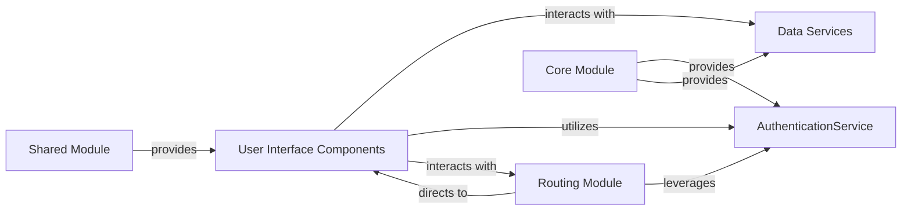

## Details

The application follows a modular architecture, typical for Angular projects, with clear separation of concerns. User interactions are handled by UI Components, which then interact with various services for data retrieval and business logic. Routing manages navigation, directing users to appropriate UI views. Core and Shared modules provide foundational and reusable functionalities across the application.

### AuthenticationService [[Expand]](./AuthenticationService.md)
This core service is responsible for managing user authentication flows, including user login, logout, and session management. It handles secure communication with the backend for authentication and manages the user's session state (e.g., storing/retrieving authentication tokens).

**Related Classes/Methods**:

- <a href="https://github.com/angular/angular/blob/main/adev/src/app/core/services/" target="_blank" rel="noopener noreferrer">`N/A`</a>

### User Interface Components
These components are the building blocks of the application's user interface. They are responsible for rendering specific views or parts of the UI, capturing user input, and displaying data. They act as the presentation layer, orchestrating interactions with services.

**Related Classes/Methods**:

- <a href="https://github.com/angular/angular/blob/main/adev/shared-docs/components/search-dialog/search-dialog.component.ts" target="_blank" rel="noopener noreferrer">`N/A`</a>

### Data Services [[Expand]](./Data_Services.md)
These services encapsulate the business logic and data access operations for specific entities or domains within the application. They abstract the communication with backend APIs, providing a clean and reusable interface for UI components to interact with data.

**Related Classes/Methods**:

- <a href="https://github.com/angular/angular/blob/main/adev/src/app/core/services/content-loader.service.ts" target="_blank" rel="noopener noreferrer">`N/A`</a>

### Routing Module [[Expand]](./Routing_Module.md)
This module defines the navigation structure of the application, mapping specific URLs to corresponding UI components or lazy-loaded modules. It manages how users move between different views and ensures proper application state transitions during navigation.

**Related Classes/Methods**:

- <a href="https://github.com/angular/angular/blob/main/adev/src/app/routes.ts" target="_blank" rel="noopener noreferrer">`N/A`</a>

### Core Module [[Expand]](./Core_Module.md)
The Core Module is designed to provide application-wide singleton services, components, and configurations that are loaded once when the application starts. It's typically imported only by the root `AppModule` to ensure that services like `AuthenticationService` are singletons across the application.

**Related Classes/Methods**:

- <a href="https://github.com/angular/angular/blob/main/adev/src/app/app.config.ts" target="_blank" rel="noopener noreferrer">`N/A`</a>

### Shared Module
The Shared Module contains common components, directives, and pipes that are used across multiple feature modules throughout the application. Its purpose is to promote reusability of UI elements and utility functions without introducing singletons, as it can be imported by multiple feature modules.

**Related Classes/Methods**:

- <a href="https://github.com/angular/angular/blob/main/adev/shared-docs/directives/index.ts" target="_blank" rel="noopener noreferrer">`N/A`</a>

### [FAQ](https://github.com/CodeBoarding/GeneratedOnBoardings/tree/main?tab=readme-ov-file#faq)