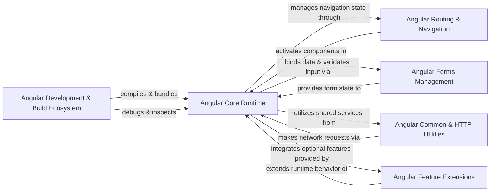

## Details

The Angular ecosystem is structured around a robust core runtime that provides the fundamental execution environment for applications. This core interacts with specialized modules for routing, forms, and common utilities, enabling a modular and scalable development approach. The entire development lifecycle is supported by a comprehensive build and development ecosystem, which includes tools for compilation, debugging, and documentation generation. This layered architecture ensures clear separation of concerns, facilitating both development and maintenance of complex applications.

### Angular Core Runtime [[Expand]](./Angular_Core_Runtime.md)
The foundational execution environment for Angular applications, encompassing Dependency Injection, Change Detection, and platform-specific layers for browser and server.

**Related Classes/Methods**:

- <a href="https://github.com/angular/angular/blob/main/packages/core/src/di/r3_injector.ts" target="_blank" rel="noopener noreferrer">`packages.core.src.di.r3_injector`</a>
- <a href="https://github.com/angular/angular/blob/main/packages/core/src/render3/view_ref.ts" target="_blank" rel="noopener noreferrer">`packages.core.src.render3.view_ref`</a>
- <a href="https://github.com/angular/angular/blob/main/packages/platform-browser/src/browser" target="_blank" rel="noopener noreferrer">`packages.platform-browser.src.browser`</a>
- <a href="https://github.com/angular/angular/blob/main/packages/platform-server/src/server.ts" target="_blank" rel="noopener noreferrer">`packages.platform-server.src.server`</a>

### Angular Routing & Navigation [[Expand]](./Angular_Routing_Navigation.md)
Manages navigation and state transitions within an Angular application, mapping URLs to components and handling route activation.

**Related Classes/Methods**:

- <a href="https://github.com/angular/angular/blob/main/packages/router/src/router.ts" target="_blank" rel="noopener noreferrer">`packages.router.src.router`</a>
- <a href="https://github.com/angular/angular/blob/main/packages/router/src/navigation_transition.ts" target="_blank" rel="noopener noreferrer">`packages.router.src.navigation_transition`</a>

### Angular Forms Management [[Expand]](./Angular_Forms_Management.md)
Provides a robust framework for building reactive and template-driven forms, handling data binding, validation, and form state.

**Related Classes/Methods**:

- <a href="https://github.com/angular/angular/blob/main/packages/forms/src/form_builder.ts" target="_blank" rel="noopener noreferrer">`packages.forms.src.form_builder`</a>
- <a href="https://github.com/angular/angular/blob/main/packages/forms/src/model/form_control.ts" target="_blank" rel="noopener noreferrer">`packages.forms.src.model.form_control`</a>

### Angular Common & HTTP Utilities [[Expand]](./Angular_Common_HTTP_Utilities.md)
A collection of widely used utilities and services, including common pipes, directives, location services, and a powerful HTTP client.

**Related Classes/Methods**:

- <a href="https://github.com/angular/angular/blob/main/packages/common/http/src/client.ts" target="_blank" rel="noopener noreferrer">`packages.common.http.src.client`</a>
- <a href="https://github.com/angular/angular/blob/main/packages/common/src/pipes/async_pipe.ts" target="_blank" rel="noopener noreferrer">`packages.common.src.pipes.async_pipe`</a>
- <a href="https://github.com/angular/angular/blob/main/packages/common/src/directives/ng_for_of.ts" target="_blank" rel="noopener noreferrer">`packages.common.src.directives.ng_for_of`</a>

### Angular Feature Extensions
Optional, pluggable modules extending Angular's core capabilities for specific needs like internationalization, animations, service workers, and custom elements.

**Related Classes/Methods**:

- <a href="https://github.com/angular/angular/blob/main/packages/localize/tools/src/extract/index.ts" target="_blank" rel="noopener noreferrer">`packages.localize.tools.src.extract.index`</a>
- <a href="https://github.com/angular/angular/blob/main/packages/animations/src/animation_builder.ts" target="_blank" rel="noopener noreferrer">`packages.animations.src.animation_builder`</a>
- <a href="https://github.com/angular/angular/blob/main/packages/service-worker/src/update.ts" target="_blank" rel="noopener noreferrer">`packages.service_worker.src.update`</a>
- <a href="https://github.com/angular/angular/blob/main/packages/elements/src/create-custom-element.ts" target="_blank" rel="noopener noreferrer">`packages.elements.src.create_custom_element`</a>

### Angular Development & Build Ecosystem [[Expand]](./Angular_Development_Build_Ecosystem.md)
Encompasses tools and processes supporting development, compilation, and debugging, including the CLI, compiler, documentation pipelines, and developer tools.

**Related Classes/Methods**:

- <a href="https://github.com/angular/angular/blob/main/packages/compiler-cli/src/main.ts" target="_blank" rel="noopener noreferrer">`packages.compiler_cli.src.main`</a>
- <a href="https://github.com/angular/angular/blob/main/adev/shared-docs/components/index.ts" target="_blank" rel="noopener noreferrer">`/home/ivan/StartUp/CodeBoarding/repos/angular/adev/shared-docs/components/index.ts`</a>
- <a href="https://github.com/angular/angular/blob/main/devtools/projects/ng-devtools/src/lib/devtools-tabs/devtools-tabs.component.ts" target="_blank" rel="noopener noreferrer">`/home/ivan/StartUp/CodeBoarding/repos/angular/devtools/projects/ng-devtools/src/lib/devtools-tabs/devtools-tabs.component.ts`</a>

### [FAQ](https://github.com/CodeBoarding/GeneratedOnBoardings/tree/main?tab=readme-ov-file#faq)