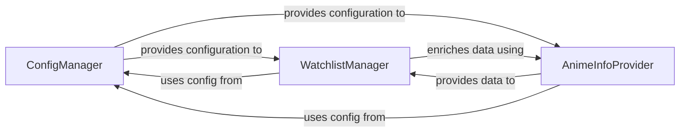

## Details

The `Application Core & State` subsystem is defined by the following core components: `anime_downloader.config`, `anime_downloader.watch`, and `anime_downloader.animeinfo`. This subsystem exhibits a clear dependency flow: Both `WatchlistManager` and `AnimeInfoProvider` depend on `ConfigManager` to retrieve necessary operational parameters and settings, establishing `ConfigManager` as a foundational utility within the core. `WatchlistManager` leverages `AnimeInfoProvider` to enrich the data of watchlist entries, demonstrating a collaborative relationship where the `WatchlistManager` focuses on state management, while the `AnimeInfoProvider` handles external data acquisition. This separation of concerns allows for modularity in how anime information is sourced and how it's managed within the application's state.

### ConfigManager
Manages application-wide configuration settings, including reading from a configuration file, writing updates, and initializing default settings. It ensures persistence of user preferences and operational parameters. This component is fundamental as it provides the necessary operational context for other parts of the application.

**Related Classes/Methods**:

- <a href="https://github.com/anime-dl/anime-downloader/blob/master/anime_downloader/config.py" target="_blank" rel="noopener noreferrer">`anime_downloader.config`</a>

### WatchlistManager
Manages a persistent list of anime that the user wants to track. This includes operations like adding new entries, removing existing ones, updating watch progress, listing entries, and importing from external sources (e.g., MyAnimeList). It handles the persistence of this data to a file. This component is central to the user's primary interaction with the application's state.

**Related Classes/Methods**:

- <a href="https://github.com/anime-dl/anime-downloader/blob/master/anime_downloader/watch.py" target="_blank" rel="noopener noreferrer">`anime_downloader.watch`</a>

### AnimeInfoProvider
Provides functionality to search for anime metadata (e.g., from MyAnimeList, Anilist) and scrape detailed information, encapsulating the data retrieval process into AnimeInfo objects. This component is crucial for enriching the user's watchlist data and providing comprehensive anime information.

**Related Classes/Methods**:

- <a href="https://github.com/anime-dl/anime-downloader/blob/master/anime_downloader/animeinfo.py" target="_blank" rel="noopener noreferrer">`anime_downloader.animeinfo`</a>

### [FAQ](https://github.com/CodeBoarding/GeneratedOnBoardings/tree/main?tab=readme-ov-file#faq)