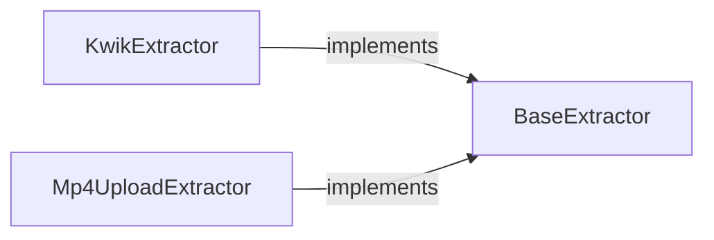

## Details

The `extractors` subsystem of `anime-downloader` is designed to abstract and manage the process of extracting media content from various online platforms. At its core, the `BaseExtractor` serves as an abstract interface, establishing a common contract for all content extraction operations. Concrete implementations, such as `KwikExtractor` and `Mp4UploadExtractor`, extend this base, providing platform-specific logic to parse and resolve media stream URLs. This architecture promotes extensibility, allowing new video platforms to be integrated by simply adding new extractor implementations that adhere to the `BaseExtractor` interface. This design effectively separates the core extraction logic from platform-specific details, embodying a "Plugin/Provider" pattern within the media content resolution process.

### BaseExtractor
An abstract interface, establishing a common contract for all content extraction operations.

**Related Classes/Methods**: _None_

### KwikExtractor
Provides platform-specific logic to parse and resolve media stream URLs.

**Related Classes/Methods**: _None_

### Mp4UploadExtractor
Provides platform-specific logic to parse and resolve media stream URLs.

**Related Classes/Methods**: _None_

### [FAQ](https://github.com/CodeBoarding/GeneratedOnBoardings/tree/main?tab=readme-ov-file#faq)